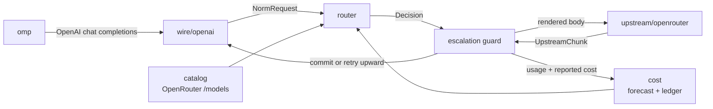

# omp-router

A local model router for [Oh My Pi](https://github.com/oh-my-pi). It presents
itself as one keyless OpenAI-compatible provider, then picks a concrete
OpenRouter model **per turn** based on measured price and estimated task
complexity — including mid-conversation, when a session shifts from mechanical
tool-loop churn to genuine reasoning work.

All LLM inference is offloaded to OpenRouter. Nothing runs on-device except
routing arithmetic.

## Why this exists when OpenRouter already ships routers

OpenRouter has `openrouter/auto` (market-spend classifier) and
`openrouter/pareto-code` (Artificial Analysis coding percentile → cheapest in
tier). Both are opaque, server-side, and — per Pareto's own docs — *"you can't
directly cap cost or latency per request."*

This router exists for the things a prompt classifier structurally cannot do:

| Lever | Why it needs to be local |
| --- | --- |
| **Agent-loop awareness** | OpenRouter sees a prompt. We see omp's tool array, tool-result depth, and whether the previous tool call failed. Most agent turns are mechanical post-tool-result continuations — the largest cost lever in agent traffic, and invisible upstream. |
| **Budget enforcement** | Per-turn, per-conversation, and rolling-24h caps, checked against a **cold-cache forecast** before dispatch, with forced downgrade at the ceiling. |
| **Mid-stream escalation** | Hold the first N tokens; on a malformed tool call, refusal, empty completion, or repeated tool call, abort and re-dispatch upward. omp never observes the failure. |
| **Cache-aware hysteresis** | Switching models forfeits the warm prompt cache. The decision is arithmetic, not vibes: expected saving must beat the forfeited cache-read discount by a configured margin. |
| **Closed-loop trust** | Per-model escalation and error rates from *your* traffic demote cheap-but-flaky models automatically. |
| **Explainability** | Every decision — candidates, rejections, forecasts, reasons — is persisted and replayable via `omp-router explain`. |

## Architecture



The core never parses a wire format. A front end produces a `NormRequest` and
consumes `UpstreamChunk`s, so a `pi-native` front end (omp's lossless canonical
transport, `POST /v1/pi/stream`) can be added later without touching routing.

### Module map

| Path | Responsibility |
| --- | --- |
| `src/catalog/` | Fetch and normalize `GET /api/v1/models`: pricing (including `pricing.overrides` long-context tiers), capability flags, Artificial Analysis quality indices. SQLite-cached with TTL. |
| `src/cost/` | Cost forecasting per candidate; reconciliation against OpenRouter's authoritative `usage.cost`; the spend ledger; per-model trust; rolling blended rate. |
| `src/tokens/` | Token estimation with no tokenizer dependency, self-calibrating from observed `prompt_tokens` per tokenizer family. |
| `src/wire/` | Protocol boundary. `wire/openai/` implements chat completions in and SSE out, with verbatim passthrough of fields the core does not model. |
| `src/router/` | Feature extraction, complexity classification, candidate filtering and scoring, hysteresis, cache-breakpoint placement, budget guard, probe planning. |
| `src/upstream/` | OpenRouter transport: streaming dispatch, `session_id` stickiness, error classification, fallback arrays. |
| `src/server/` | `Bun.serve` HTTP surface. |
| `src/cli/` | `serve`, `stats`, `models`, `explain`, `config`. |

### Two cost numbers, never conflated

- **Predicted** — our arithmetic over the catalog, computed *before* dispatch.
  Drives routing and budget guards. Must model `pricing.overrides` tiers, or
  long conversations are underestimated by ~50% exactly when it matters.
- **Reported** — `usage.cost` from OpenRouter, authoritative after the fact.
  Drives the ledger, `stats`, and prediction-error calibration.

## Setup

```bash
bun install
bun run serve
```

### The OpenRouter key

There should be exactly one OpenRouter key on the machine, and omp already owns
a credential store. Resolution order:

1. `openrouter.apiKey` in `$OMP_ROUTER_HOME/config.yml`
2. `OPENROUTER_API_KEY` (including any `.env` omp loaded into the environment)
3. **omp's own auth store** — `~/.omp/agent/agent.db`, provider `openrouter`

So `/login openrouter` inside omp is sufficient setup; nothing needs copying.
The store is opened read-only and never written: omp owns it, including OAuth
refresh. An expired OAuth access token is rejected rather than sent, because
refreshing is omp's job and a stale bearer just burns a turn on a 401. Under
`OMP_AUTH_BROKER_URL` the local store is not consulted at all, since a broker
replaces it.

`omp-router serve` prints the provenance at startup and `GET /health` reports
`apiKeySource` (`config` | `env` | `omp-auth-store` | `none`) — never the key.

## Toast notifications for the chosen model

omp-router is headless and cannot draw into omp's TUI, so chosen-model toasts
come from a small omp extension that polls the router's decision ledger:

```ts
// omp-extension/router-toast.ts  (shipped in this repo)
```

It raises a TUI toast (`ctx.ui.notify`) like
`meta/muse-glimmer-30b [trivial] · $0.00001` whenever a new model is chosen.
Install it by adding the file's absolute path to omp's `extensions:` list:

```yaml
# ~/.omp/agent/config.yml
extensions:
  - /path/to/omp-router/omp-extension/router-toast.ts
```

Then restart the omp session (extensions load at session start). The router
base URL defaults to `http://127.0.0.1:8788`; override with `OMP_ROUTER_URL`.

The toast logic is a pure, unit-tested module
(`omp-extension/toast-logic.ts`, covered by `test/toast-logic.test.ts`): it
toasts only entries newer than the last seen one, skips `wasted` escalation
attempts, and prefers the actual serving slug over the requested one.


Register it with omp (`omp-router config` prints this block; `--write` merges it
into `~/.omp/agent/models.yml` between guard comments, after a backup):

```yaml
providers:
  omp-router:
    baseUrl: http://127.0.0.1:8787/v1
    api: openai-completions
    auth: none
    models:
      - id: auto
        name: Auto (omp-router)
        # ...contextWindow, maxTokens, and a blended `cost` derived from your ledger
```

## HTTP surface

| Route | Purpose |
| --- | --- |
| `POST /v1/chat/completions` | Routed completion, streaming or buffered. |
| `GET /v1/models` | Virtual profiles (`auto`, `auto-cheap`, `auto-max`). |
| `GET /v1/router/stats` | Spend, per-model breakdown, escalation and trust rates. |
| `GET /v1/router/decisions` | Recent decisions with full reasoning. |
| `GET /health` | Liveness plus catalog freshness. |

Every routed response carries `x-omp-router-model`, `x-omp-router-tier`,
`x-omp-router-cost-usd`, and `x-omp-router-attempts`.

## Verifying

```bash
bun run typecheck   # strict, exactOptionalPropertyTypes + noUncheckedIndexedAccess
bun test            # unit suite
bun run smoke       # end-to-end against a scriptable mock OpenRouter
```

`bun run smoke` starts the real server against `tools/mock-openrouter.ts`, which
serves the genuine 147-model catalog fixture and synthesizes OpenRouter-shaped
SSE. It asserts the properties that matter: no `openrouter/*`, `~alias`,
`:batch`, or `stealth/*` slug is ever selected; a mechanical tool-result
continuation routes to a cheaper tier than an architecture question in the same
conversation; a malformed tool call is escalated to a stronger model without the
client ever seeing the failure; and the abandoned attempt is booked as wasted
spend.

`omp-router explain --file request.json` routes a saved request and prints the
feature vector, classification reasoning, ranked candidates with forecasts, and
every rejection with its cause — without dispatching a completion.

## Status

Working end to end against a mock upstream; not yet exercised against a live
`OPENROUTER_API_KEY`. Contracts are frozen in `src/**/types.ts`.

Known gaps:

- The `pi-native` front end is designed for but not implemented; only the
  OpenAI-compatible wire exists today.
- Blended `cost` figures in `models.yml` are refreshed by re-running
  `omp-router config --write`, not automatically.
