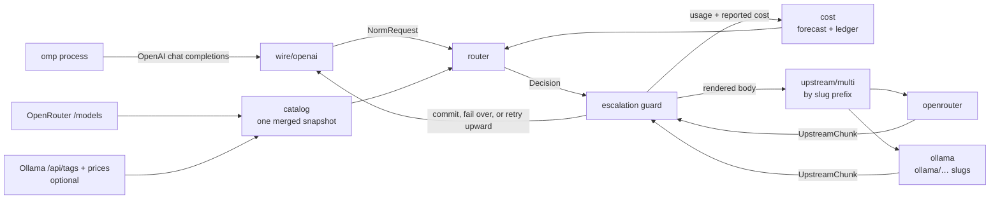

# auto-model-router

**[Website & benchmarks →](https://drewappling.github.io/auto-model-router/)**

A local model router for [Oh My Pi](https://github.com/oh-my-pi). It presents
itself as one keyless OpenAI-compatible provider, then picks a concrete model
**per turn** — from OpenRouter's catalog, and from
[Ollama Cloud](#ollama-cloud) when that is enabled too — based on measured
price and estimated task complexity, including mid-conversation, when a
session shifts from mechanical tool-loop churn to genuine reasoning work.
With both providers on, every turn ranks the candidates of both together and
fails over across them.

auto-model-router runs **embedded inside the omp process** (as an omp extension) — no
separate server, no orphaned process. It binds a free OS-assigned port and
lives and dies with the omp session.

For non-omp harnesses (Hermes, Claude, any OpenAI-compatible client), run it as
a standalone process with `auto-model-router serve --port <n>` — the same core,
on a fixed port, owned by you. See [Hermes](#hermes) below.

## Why this exists when OpenRouter already ships routers

OpenRouter has `openrouter/auto` (market-spend classifier) and
`openrouter/pareto-code` (Artificial Analysis coding percentile → cheapest in
tier). Both are opaque, server-side, and — per Pareto's own docs — *"you can't
directly cap cost or latency per request."*

This router exists for the things a prompt classifier structurally cannot do:

| Lever | Why it needs to be local |
| --- | --- |
| **Agent-loop awareness** | OpenRouter sees a prompt. We see omp's tool array, tool-result depth, and whether the previous tool call failed. Most agent turns are mechanical post-tool-result continuations — the largest cost lever in agent traffic, and invisible upstream. |
| **Budget enforcement** | Per-turn, per-conversation, and rolling-24h caps, checked against a **cold-cache forecast** before dispatch, with forced downgrade at the ceiling. |
| **Mid-stream escalation** | Hold the first N tokens; on a malformed tool call, refusal, empty completion, or repeated tool call, abort and re-dispatch upward. omp never observes the failure. |
| **Cache-aware hysteresis** | Switching models forfeits the warm prompt cache. The decision is arithmetic, not vibes: expected saving must beat the forfeited cache-read discount by a configured margin. |
| **Closed-loop trust** | Per-model escalation and error rates from *your* traffic demote cheap-but-flaky models automatically. |
| **Explainability** | Every decision — candidates, rejections, forecasts, reasons — is persisted and replayable via `auto-model-router explain`. |

## Measured against Claude Opus 5

Five benchmark runs, 88 graded task runs, 2026-08-29. Each task is a real omp
session working in a pristine git workspace from a written spec. Hidden tests are
copied in only *after* the agent exits, so they cannot be read or edited by it;
every task is verified to fail an untouched workspace and to pass a reference
solution. Both arms are metered from omp's own event stream, run under an
identical tool surface, and are checked per turn against their expected provider.
The router arm routes freely — nothing pinned. The baseline is `claude-opus-5`
on Anthropic first-party.

### Core suite — 10 coding tasks × 3 trials

| | auto-model-router | Claude Opus 5 |
| --- | --- | --- |
| Tasks solved | **30 / 30** | 30 / 30 |
| Total cost | **$0.63** | $16.61 |
| Cost per solved task | **$0.0209** | $0.5538 |
| Turns to finish | **278** | 303 |
| Tool calls | **265** | 337 |
| Wall clock | **2 057 s** | 3 185 s |
| Median time to first token | 5 776 ms | **1 490 ms** |

**26.5× cheaper at identical correctness** — and in fewer turns, fewer tool
calls, and 19 minutes less wall clock. The saving is not bought by grinding out
extra turns. The one regression is time to first token: a routed turn pays for
classification and dispatch before anything streams back.

Per task the ratio ranges from 9× to 264×. The widest gaps are tasks where the
single-model baseline entered long tool loops — `semver` and `queue-order` cost
it $2.99 each across three trials against a $1.32 median, 36% of its entire bill.

### Difficulty ladder — 7 rungs, run twice

A second suite of deliberately escalating difficulty, ending in npm semver range
semantics and a minimal diff with a specified tie-break.

| | auto-model-router | Claude Opus 5 |
| --- | --- | --- |
| Run 1 | 5 / 7 · $0.30 | 5 / 7 · $6.25 |
| Run 2 | 5 / 7 · $0.46 | **6 / 7** · $6.60 |

At the top of the ladder the engines separate: they fail different rungs, and on
the second run the single-model baseline finished one more. Both arms timed out
on the semver rung at the 10-minute cap.

### What it routed to

Across 464 routed turns in all five runs:

| Model | Turns | Input price | Role |
| --- | --- | --- | --- |
| `z-ai/glm-5.3-flash` | 389 (84%) | $0.07 / MTok | default |
| `google/gemini-3.7-flash` | 56 (12%) | $0.75 / MTok | escalation target |
| `x-ai/grok-4.6` | 18 (4%) | $2.00 / MTok | escalation target |

**Tier escalation converts to a costlier model roughly one-for-one**: on the
ladder, the count of turns classified `hard` matched the count served by
something other than the default (6/6, 4/4, 3/3, 5/5, 7/7, 1/1 across rungs and
runs). The escalation *target* is chosen live from trust and latency history, so
it differs between runs on the same catalog — run 1 stepped up to
`gemini-3.7-flash`, run 2 to `grok-4.6`.

Escalation stays inside the cheaper half of the catalog. A model priced above a
tier's `maxInputPerMtok` is excluded before ranking, and at `hard` the
`(quality/100)^qualityExponent ÷ expected cost` score favours cheaper models that
score nearly as well. If your workload needs a frontier model on hard turns,
raise the tier price ceiling and `qualityExponent` — measured thresholds are in
[`docs/routing-benchmark-findings.md`](docs/routing-benchmark-findings.md).

### Real-world — a week on the live ledger

The suites above are small and clean. To measure the economics on *actual*
usage we replayed a week of real omp traffic from the router's own ledger —
**6 918 billed turns across 299 conversations, 7 days, 410:1 input-to-output,
68% cache hit** — and repriced the identical token stream against a single Opus 5
model with its own cache namespace.

| | auto-model-router | Claude Opus 5 (single-model) |
| --- | --- | --- |
| Spend over the week | **$61.69** | $921.20 |
| Per turn | **$0.0089** | $0.133 |
| Extrapolated / month | **$263** | $3 932 |

**≈15× cheaper, ~93% saved** — a four-figure monthly bill becomes a three-figure
one. This baseline is deliberately conservative: one cache namespace, with each
conversation's cache replayed on the real turn gaps. A naive like-for-like
repricing at Opus rates reports ~31×, but on a single model the replayed context
is cache reads at $0.50/MTok, so ≈15× is the number we stand behind. Unlike the
core suite, sustained work on a large codebase is dominated by the conversation
resent each turn rather than per-token price — exactly where a single frontier
model gets expensive and routing's per-turn cache awareness pays off.

### Scope

These are small, self-contained tasks of one to three files, solved in under 25
turns. On the core suite both engines solved everything, so it measures cost at
equal correctness rather than capability; the ladder is where capability
separates. The cost multiple varied between 14× and 32× across runs depending on
which task the baseline stalled on — treat "well over an order of magnitude" as
the claim, not a specific figure.

Harness, tasks and raw per-turn data:
[`docs/routing-benchmark-findings.md`](docs/routing-benchmark-findings.md).

## Architecture



The router runs in-process inside omp via the `router-embed` extension. The
core never parses a wire format. A front end produces a `NormRequest` and
consumes `UpstreamChunk`s, so a `pi-native` front end can be added later
without touching routing.

### Module map

| Path | Responsibility |
| --- | --- |
| `src/catalog/` | Fetch and normalize OpenRouter `/api/v1/models`: pricing, capability flags, Artificial Analysis quality indices. SQLite-cached with TTL. `ollama-catalog.ts` builds Ollama Cloud models from `/api/tags`, a shipped price table and OpenRouter twins; `composite.ts` merges the two into one snapshot. |
| `src/cost/` | Cost forecasting per candidate; reconciliation against OpenRouter's authoritative `usage.cost`; the spend ledger; per-model trust; rolling blended rate; `report.ts` usage analytics. |
| `src/tokens/` | Token estimation with no tokenizer dependency, self-calibrating from observed `prompt_tokens` per tokenizer family. |
| `src/wire/` | Protocol boundary. `wire/openai/` implements chat completions in and SSE out. |
| `src/router/` | Feature extraction, complexity classification, candidate filtering and scoring, hysteresis, cache-breakpoint placement, budget guard, probe planning. |
| `src/upstream/` | Transports: OpenRouter (streaming dispatch, `session_id` stickiness, error classification, fallback arrays) and Ollama Cloud (body rewrite for its compatibility layer, quota/rate-limit breaker); `multi.ts` dispatches by slug prefix. |
| `src/config/` | Configuration loading, schema validation, and the built-in defaults. |
| `src/cli/` | `serve`, `stats`, `report`, `models`, `explain`, `config` commands. |
| `omp-extension/` | The omp extensions: `router-embed.ts`, `router-toast.ts`, `router-configure.ts` (`/router` config, report, status). |

### Two cost numbers, never conflated

- **Predicted** — our arithmetic over the catalog, computed *before* dispatch.
  Drives routing and budget guards. Must model `pricing.overrides` tiers, or
  long conversations are underestimated by ~50% exactly when it matters.
- **Reported** — `usage.cost` from OpenRouter, authoritative after the fact.
  Drives the ledger, `stats`, and prediction-error calibration.

## Installing

No separate Bun install is needed for the embedded path. The standalone
`serve` binary (`npm install -g auto-model-router`) bundles Bun.

Two ways to get the router into omp. The **npm package** is the modern path —
it installs the `auto-model-router` binary and wires the omp extensions; the
**repo-local installer** is for developing against the source.

### Via npm (installs the `auto-model-router` binary)

```bash
npm install -g auto-model-router
```

Then add the shipped extensions to omp's `~/.omp/agent/config.yml`
(`$PI_CODING_AGENT_DIR/config.yml` when that env var relocates the agent dir):

```yaml
# ~/.omp/agent/config.yml
extensions:
  - auto-model-router/omp-extension/router-embed.ts
  - auto-model-router/omp-extension/router-toast.ts      # optional: chosen-model toasts
  - auto-model-router/omp-extension/router-configure.ts # optional: /router config, report, status
  - auto-model-router/omp-extension/router-digest.ts    # optional: cheap-model digest of large tool results
```

### From the repo (cross-platform installer)

```bash
bun tools/install.ts
```

It wires the auto-model-router extensions into omp's `~/.omp/agent/config.yml`
(`$PI_CODING_AGENT_DIR/config.yml` when that env var relocates the agent dir),
backing up the previous file first. It is idempotent — re-running is a no-op.

Options:

```bash
bun tools/install.ts --no-toast --no-configure   # only the required embed extension
```

The installer adds:

- `router-embed.ts` — **required**; runs the router in-process.
- `router-toast.ts` — optional; chosen-model toasts.
- `router-configure.ts` — optional; the `/router` command (configure, usage reports, status).
- `router-digest.ts` — optional; condenses large tool results with a cheap model before an expensive one reads them (needs `digest.enabled`).

Or add the paths by hand to omp's `~/.omp/agent/config.yml`:

```yaml
# ~/.omp/agent/config.yml
extensions:
  - /path/to/auto-model-router/omp-extension/router-embed.ts
  - /path/to/auto-model-router/omp-extension/router-toast.ts      # optional: chosen-model toasts
  - /path/to/auto-model-router/omp-extension/router-configure.ts # optional: /router config, report, status
  - /path/to/auto-model-router/omp-extension/router-digest.ts    # optional: cheap-model digest of large tool results
```

Then restart the omp session (extensions load at session start).

or install it from the marketplace (see below). The plugin declares all three
extensions (`router-embed`, `router-toast`, `router-configure`), so installing
it wires the router in without editing `config.yml` by hand.

### Install from the marketplace

This repo doubles as its own marketplace: it ships a catalog at
`.omp-plugin/marketplace.json` listing the `auto-model-router` plugin. Add the repo as
a marketplace source, then install the plugin:

```bash
omp plugin marketplace add drewappling/auto-model-router
omp plugin install auto-model-router@auto-model-router
```

or in the TUI:

```
/marketplace add drewappling/auto-model-router
/marketplace install auto-model-router@auto-model-router
```

After installing, restart the omp session (extensions load at session start),
then `/model` and pick `auto-model-router/auto`.

### Install from the Pi package marketplace

The repo is also a Pi package (see the `pi` manifest and `pi-package` keyword
in `package.json`), so it can be installed with the Pi CLI and listed on
[pi.dev/packages](https://pi.dev/packages):

```bash
pi install npm:auto-model-router
```

or from git:

```bash
pi install git:github.com/drewappling/auto-model-router
```

#### Releasing

Cut releases with `npm version` (or `bun run release <patch|minor|major>`), not a
bare `npm publish`:

```bash
npm version patch && git push --follow-tags   # or: bun run release patch
```

`npm version` runs the `version` lifecycle script
(`tools/sync-marketplace-version.ts`), which rewrites the Git-marketplace
catalog (`.omp-plugin/marketplace.json`) to the new version and stages it into
the version commit — so the npm package and the marketplace catalog can never
drift. Pushing the `vX.Y.Z` tag triggers the release workflow (npm publish,
which auto-indexes on pi.dev/packages, plus a GitHub Release). A bare
`npm publish` skips both the catalog sync and the tag, so avoid it.

### Hermes

Install the router globally (puts the `serve` binary on PATH) and
install the native plugin, then point Hermes at it:

**1. Install the router binary:**

```bash
npm install -g auto-model-router
```

**2. Install the Hermes plugin.** Copy `hermes-plugin/` to
`$HERMES_HOME/plugins/model-providers/auto-model-router/` (where
`HERMES_HOME` is `C:\Users\<you>\AppData\Local\hermes` on Windows,
`~/.hermes` on macOS/Linux):

```bash
mkdir -p "$HERMES_HOME/plugins/model-providers"
cp -r hermes-plugin/ "$HERMES_HOME/plugins/model-providers/auto-model-router/"
```

**3. Surface the provider in Hermes's picker.** Hermes only lists providers
that have a credential. The router itself is keyless (it resolves its own
OpenRouter key), but to make Hermes show it as selectable, add a marker value
to `$HERMES_HOME/.env`:

```bash
echo "AUTO_MODEL_ROUTER_API_KEY=local" >> "$HERMES_HOME/.env"
```

**4. Restart Hermes.** On load, the plugin spawns the router (`auto-model-router
serve`) as a subprocess on port 8788 and registers the provider profile. Select
`auto-model-router/auto` as the model.

The plugin runs the router against its **own** config home
(`$HERMES_HOME/auto-model-router/`), separate from omp's
`~/.auto-model-router/`, so the two harnesses never share a ledger or
conversation state and don't leak routing toasts into each other's UIs.

The router serves `GET /v1/models` (returning the `auto`, `auto-cheap`,
`auto-max` profiles) and `POST /v1/chat/completions`, which Hermes's custom
endpoint discovery verifies. The router's own OpenRouter key resolution
(config → env → omp auth store) applies — Hermes does not need its own
OpenRouter key.

**Standalone alternative (no plugin):** run the router yourself, then add a
custom provider:

```bash
auto-model-router serve --port 8788
```

```yaml
# $HERMES_HOME/config.yaml
providers:
  auto-model-router:
    base_url: http://127.0.0.1:8788/v1
    api_key: local
    default_model: auto
```

**Native features (Hermes plugin API).** The provider plugin above only
registers the model provider; Hermes never calls `register(ctx)` on
provider plugins, so the features that need hooks live in a second,
standalone plugin:

```bash
cp -r hermes-plugin/native "$HERMES_HOME/plugins/auto-model-router"
hermes plugins enable auto-model-router
```

It adds, through Hermes middleware and hooks:

- **Session identity** — `X-Omp-Session` and `X-Omp-Subagent` on every router
  request (a session that reported a parent session is a subagent), so
  per-session reports, `/router why`, feedback and the router's
  `server.subagentProfile` work as in omp. `X-Omp-Harness` is `hermes` (or
  `OMP_HARNESS_ID`).
- **Tool-result digest** — large `read_file`, `search_files` and `terminal`
  results go to `/v1/router/digest` and the model gets the digest (see
  [`digest`](#digest--cheap-model-digest-of-large-tool-results); Hermes tool
  names are mapped by `digest.toolAliases`). Off unless `digest.enabled`.
- **`/router`** — `report [days] [--all]`, `summary`, `status`, `why`,
  `good`/`bad [note]`, `pin <model|off>`, `tier <tier|off> [turns]`, as text.

Point Hermes's side jobs at the cheap profile so they cost what omp's do:

```yaml
# $HERMES_HOME/config.yaml
auxiliary:
  vision:      { provider: auto-model-router, model: auto-cheap }
  compression: { provider: auto-model-router, model: auto-cheap }
```

Not available in Hermes: a per-turn routing toast (its plugin API has no
user-visible notice channel; use `/router why`), the automatic daily summary
(`/router summary` on demand), and the harness-side model switch.

### Codex CLI

Codex (0.150 and later) speaks only the Responses API, which the router
serves at `POST /v1/responses`: the body is translated to the chat shape
the router routes on (`instructions` → system, `input` items → messages,
function calls and outputs → tool calls and tool messages) and the upstream
stream is rendered back as Responses events. Run the router
(`auto-model-router serve --port 8788`) and add a provider:

```toml
# ~/.codex/config.toml
model = "auto"
model_provider = "auto-model-router"

[model_providers.auto-model-router]
name = "auto-model-router"
base_url = "http://127.0.0.1:8788/v1"
env_key = "AUTO_MODEL_ROUTER_API_KEY"   # any value; the router is keyless
wire_api = "responses"
http_headers = { "X-Omp-Harness" = "codex" }
```

Verified live with codex 0.153, text and tool-call turns: the captured
request is `test/fixtures/harness/codex-responses.json`. Stateless only —
Codex sends `store: false` and the full input each turn; `previous_response_id`
is rejected. Reasoning summaries and encrypted reasoning are not produced.
Codex's thread id (sent in the body) becomes the session id and its agent
name marks subagents, so per-session reports, feedback over the HTTP API and
the subagent profile work without a plugin. No hooks: there is no toast,
digest or `/router`.

### Aider

```bash
export OPENAI_API_BASE=http://127.0.0.1:8788/v1
export OPENAI_API_KEY=local
aider --model openai/auto
```

Verified live with aider 0.86 (captured request:
`test/fixtures/harness/aider.json`). Aider sends no tool calls, so every turn
classifies on its text alone. It sends no custom headers by default; a model
settings file in the project adds the harness id (verified live):

```yaml
# .aider.model.settings.yml
- name: openai/auto
  extra_params:
    extra_headers:
      X-Omp-Harness: aider
```

No session id or hooks.

### Cline CLI

```bash
cline auth -p openai -b http://127.0.0.1:8788/v1 -k local -m auto
cline -P openai -m auto "your task"
```

Verified live with cline 3.0 (captured request:
`test/fixtures/harness/cline-cli.json`). The CLI sends native tool calls
(`read_files`, `search_codebase`, `run_commands`, `fetch_web_content`, …),
all in `digest.toolAliases`, and no custom headers, so its rows carry no
harness id. No session id or hooks.

### Kilo Code CLI

Kilo's CLI is built on OpenCode, so its config is OpenCode's with a different
file name:

```json
// kilo.json in the project (or ~/.config/kilo/kilo.json)
{
  "provider": {
    "auto-model-router": {
      "npm": "@ai-sdk/openai-compatible",
      "name": "auto-model-router",
      "options": { "baseURL": "http://127.0.0.1:8788/v1", "apiKey": "local", "headers": { "X-Omp-Harness": "kilo" } },
      "models": { "auto": { "name": "auto" }, "auto-cheap": { "name": "auto-cheap" } }
    }
  },
  "model": "auto-model-router/auto"
}
```

Verified live with kilo 7.5 (captured request:
`test/fixtures/harness/kilo.json`); tool names match OpenCode's. The
OpenCode plugin was not picked up from `.kilo/plugin`, `.opencode/plugin` or
the config's `plugin` list in this test, so Kilo is config-only for now.

### Roo Code (VS Code)

Roo's welcome screen has *Import Settings*; a profile file skips the form:

```json
{
  "providerProfiles": {
    "currentApiConfigName": "auto-model-router",
    "apiConfigs": {
      "auto-model-router": {
        "apiProvider": "openai",
        "openAiBaseUrl": "http://127.0.0.1:8788/v1",
        "openAiApiKey": "local",
        "openAiModelId": "auto",
        "openAiHeaders": { "X-Omp-Harness": "roo" },
        "openAiCustomModelInfo": { "maxTokens": 8192, "contextWindow": 400000, "supportsImages": true, "supportsPromptCache": true, "inputPrice": 0, "outputPrice": 0 },
        "id": "amr-0001"
      }
    }
  }
}
```

Verified live with Roo Code 3.54 (captured request:
`test/fixtures/harness/roo.json`, including a tool round trip): native tool
calls (`read_file`, `search_files`, `list_files`, `apply_diff`, …), all in
`digest.toolAliases`, and the harness header through `openAiHeaders`. Two
cautions: 3.54 announces itself as the last Roo Code release, and its
Architect mode loops on a model that never calls `attempt_completion`, so
start in Code mode or pin a stronger profile (`auto-max`) for it. No session
id or hooks: the digest applies only through summarising compaction.

### Cline (VS Code)

Choose the *OpenAI Compatible* provider in the extension's settings, set the
base URL to `http://127.0.0.1:8788/v1`, any API key, and the model id `auto`
(or `auto-cheap` / `auto-max`); add `X-Omp-Harness` under custom headers if
offered. Not verified live here (the CLI above was); its tool names are in
`digest.toolAliases`, and the digest applies only through summarising
compaction.

### OpenCode

```json
// ~/.config/opencode/opencode.json
{
  "provider": {
    "auto-model-router": {
      "npm": "@ai-sdk/openai-compatible",
      "name": "auto-model-router",
      "options": { "baseURL": "http://127.0.0.1:8788/v1", "apiKey": "local", "headers": { "X-Omp-Harness": "opencode" } },
      "models": { "auto": { "name": "auto" }, "auto-cheap": { "name": "auto-cheap" }, "auto-max": { "name": "auto-max" } }
    }
  },
  "model": "auto-model-router/auto"
}
```

Verified live with opencode 1.18 (captured request:
`test/fixtures/harness/opencode.json`). OpenCode's AI SDK validates every
SSE frame, which is why the router's final summary frame is shaped as a
chunk with no choices. Its tool names (`read`, `grep`, `glob`, `bash`,
`webfetch`) match the router's canonical list.

**Native features (OpenCode plugin API).** Copy
`opencode-plugin/auto-model-router.ts` to `~/.config/opencode/plugin/` (or a
project's `.opencode/plugin/`); OpenCode loads it on start. It adds:

- **Session identity** — `X-Omp-Session`, `X-Omp-Harness` (`opencode`, or
  `OMP_HARNESS_ID`) and `X-Omp-Subagent` for sessions with a parent, through
  the `chat.headers` hook.
- **Routing toast** — when a session goes idle, its last routed turn's
  provider, model, tier and cost appear as a TUI toast.
- **Tool-result digest** — large `read`, `grep`, `glob`, `bash` and
  `webfetch` results go to `/v1/router/digest` through `tool.execute.after`
  and the model gets the digest. Off unless `digest.enabled`.

No `/router` command (OpenCode commands are markdown files, not plugin
hooks): use `auto-model-router report` on the terminal, or the router's
HTTP endpoints.

### The OpenRouter key

**omp does not need to be authenticated to OpenRouter.** On a routed turn omp
never calls OpenRouter directly: the embed extension registers the
`auto-model-router` provider with a placeholder bearer (`embedded`) pointing at
the in-process router, and the router holds the real OpenRouter key and makes
the upstream call. omp only needs to see that the provider "has credentials",
which the placeholder satisfies.

There should be exactly one OpenRouter key on the machine. The router resolves
it in this order:

1. `openrouter.apiKey` in `$AUTO_MODEL_ROUTER_HOME/config.yml` — router-owned,
   never enters omp's environment. Set it with `auto-model-router config` or by
   hand.
2. `OPENROUTER_API_KEY` in the environment omp launches from (including any
   `.env` omp loaded).
3. **omp's own auth store** — `~/.omp/agent/agent.db`, provider `openrouter`, so
   `/login openrouter` inside omp is sufficient and nothing needs copying.

Options 1–2 give the router its own key with omp left unauthenticated; option 3
is a zero-config convenience for when you *have* logged omp in. The store is
opened read-only and never written: omp owns it, including OAuth refresh. An
expired OAuth access token is rejected rather than sent, because refreshing is
omp's job and a stale bearer just burns a turn on a 401. Under
`OMP_AUTH_BROKER_URL` the local store is not consulted at all, since a broker
replaces it.

The embedded router reports the key source via its in-process `GET /health`
(`config` | `env` | `omp-auth-store` | `none`) — never the key itself.

### Available models & guardrails

The router never ships a hand-curated model list. With a key configured it
fetches the **key-scoped catalog** (`GET /models/user`) — the exact set of
models that key is *entitled to* under your account's active
[OpenRouter guardrails](https://openrouter.ai/docs/guides/features/guardrails),
provider preferences, and data policies — and routes only within it. Keyless, it
falls back to the public `/models` for pricing and capability discovery, but
dispatch still needs a key.

Your OpenRouter guardrails — model and provider allowlists, budget limits,
Zero-Data-Retention and privacy rules — are therefore the router's outer
boundary: a model your key cannot reach is never a routing candidate. The
catalog is refetched in the background every `catalogRefreshMs` (default 5 min),
so tightening or relaxing a guardrail is picked up without a restart. A refresh
that keeps fewer than half the previous models is adopted (your guardrails are
authoritative) but logged at `warn` and reported as `catalog.shrink` on
`GET /health` until the catalog recovers, because a sharp shrink reroutes every
turn onto whatever survived. If a
guardrail narrows the eligible set below a tier's quality floor,
`adaptiveTierFloors` (on by default) relaxes that tier to the best available
models rather than leaving it empty — see [Adaptive tier floors](#adaptive-tier-floors)
and [Tier rescue](#tier-rescue) below.

---

## How it runs

At session start, the **main** omp session's `router-embed.ts`:

1. binds a **free OS-assigned port** (`Bun.serve({ port: 0 })`) so several omp
   sessions never collide on a fixed port;
2. writes the actual bound port to the shared `$AUTO_MODEL_ROUTER_HOME/embed.port`;
3. registers an `auto-model-router` provider with omp (`auto`, `auto-cheap`, `auto-max`
   virtual models) pointing at `http://127.0.0.1:$PORT/v1`.

Subagents do **not** bind their own router. They are ephemeral worker processes
whose PIDs get recycled, so a per-process port file is a race. Instead every
subagent registers the same shared provider and routes to the main session's
single router, whose port lives in the one shared `embed.port` file — one
authoritative writer, no stale per-PID port.

The router lives and dies with the main omp session — no orphan process, no "is
the server running?" stopping the omp process frees the port automatically.

### Multiple omp sessions, one machine

Each top-level omp session binds its own router on its own ephemeral port, so
they never conflict. The `X-Omp-Harness` header (from `server.harnessId`)
scopes budgets, toasts, and optional trust per harness.

---

## Selecting the provider / model

The router registers three virtual models under the `auto-model-router` provider:

| Profile | Min tier | Max tier | Use |
| --- | --- | --- | --- |
| `auto` | trivial | hard | Default — routes by complexity across the whole range. |
| `auto-cheap` | trivial | simple | Cost-first — caps at the `simple` tier. |
| `auto-max` | moderate | hard | Quality-first — never below `moderate`. |

Select one in omp via `/model` and pick `auto-model-router/auto` (or one of the
others). Or set it as the default for a role in `~/.omp/agent/config.yml`:

```yaml
modelRoles:
  default: auto-model-router/auto
```

The router decides the concrete OpenRouter model **per turn**; omp only sees the
virtual profile it picked. Every routed response carries
`x-auto-model-router-model`, `x-auto-model-router-tier`, `x-auto-model-router-cost-usd`, and
`x-auto-model-router-attempts`.

---

## Usage reports

The ledger records every dispatch: model decided and served, tier, provider,
tokens (including cached), reported cost, time to first token, total latency,
escalation signal, error. Three views aggregate it, all from the same
`buildUsageReport` in `src/cost/report.ts`:

- `/router report` in omp — a fullscreen hub with the `/models` look: views
  for overview, providers, models, tiers, by day and status in a sidebar, plus
  a Window selector (24h / 7d / 30d / 90d) and, when `OMP_HARNESS_ID` is set,
  a scope toggle between this harness and all harnesses. ↑/↓ move, Enter
  applies a window or scope, ←/→ also cycle the window, PgUp/PgDn scroll, r
  reloads, Esc closes. Headless sessions get the same report as text in the
  transcript. Falls back to reading the ledger directly if the router is
  unreachable.
- `auto-model-router report --days 7 [--harness <id>] [--json]` on the terminal.
- `auto-model-router export --days 30 [--harness a,b] [--json]`: one row per day, harness
  and model (dispatches, tokens, spend, escalations, errors) as CSV. Also
  `GET /v1/router/export?days=&harness=[&format=json]`; `GET /v1/router/spend?sinceMs=&harness=`
  gives spend over a harness set since an instant, and `GET /v1/router/feedback?days=&harness=`
  lists verdicts by model and the recent ones with the harness that gave them. These are what
  a front door such as the team edition reads instead of the ledger file.
- `GET /v1/router/report?days=7&harness=<id>` for dashboards (`harness` may be
  a comma-separated set of ids, for a group).
- `GET /v1/router/summary?harness=<id>` — the daily summary as JSON (`auto=1`
  applies the once-a-day gate and returns `due: false` when nothing is due).

What it shows, for the window:

| Block | Columns |
| --- | --- |
| totals | spend, dispatches, conversations, $/dispatch, prompt and completion tokens, cache hit rate, model switches, escalations, failovers, errors (aborted separately), subagent dispatches and their share of spend |
| prompt anatomy | mean share of prompt bytes by role (tool results, assistant, user, system), tool schemas beside them, the older half of the conversation, and tool results older than the newest 20 messages — what compaction can reach. Recorded per turn from v0.3.5. |
| providers | per upstream (`openrouter`, `ollama`): dispatches, spend, share, cache hit, mean TTFT, tokens/s, escalations, errors |
| models | per served slug (top 12 by spend): the same plus user feedback (`+good/-bad` from `/router good\|bad`) and the tier mix it was routed for |
| tiers | per tier: dispatches, spend, share, cache hit, mean prompt tokens, escalations |
| by day | UTC calendar days: dispatches, spend, cache hit |
| same traffic on one model | the window's tokens priced on each `report.baselines` model at list price with the window's cache hit rate, and what share the router saved against it |

**Soft-failure spikes.** `/health` (`softFailures.spikes`), `/router status`
and the daily summary list any model whose failure rate over the last hour —
probe rejections such as `empty_completion` or `repeat_tool_call` that
OpenRouter counts as success, plus attributable transport errors — is at
least 25%, at least twice its own rate over the preceding 7 days, and covers
at least 5 dispatches with 3 failures. This is visibility only: two weeks of
ledger data showed soft failures do not cluster tightly enough for a breaker
to save money (after a burst, the next 15 minutes ran 84–1,577 successes per
13–50 failures), and OpenRouter's provider failover plus the router's own
escalation already cover the retry. Use a spike as the cue to `/router pin`
or deny a model for the session.

Spend follows the ledger's rule — the provider's reported cost when it gave
one, else the usage-priced figure the router computed, else the forecast.
Speed uses only clean streamed rows (TTFT recorded, no error); tokens/s is
completion tokens over time after first token. Ollama Cloud caches prompt
prefixes and bills them at its cached rate but reports no count, so the
router estimates it (see [Ollama Cloud](#ollama-cloud)); cache rates that
include such rows are shown with a `~`.

## Configuring the router

The router's own config lives at `$AUTO_MODEL_ROUTER_HOME/config.yml` (default
`~/.auto-model-router/config.yml`). Every key is optional — unset keys use the
built-in defaults below. There are two ways to edit it:

### Via `/router` (in-omp, native UI)

Install the `router-configure` extension, restart omp, then run `/router` in
the session prompt. With no arguments it shows a menu (Configure, Report,
Status); the subcommands go straight there:

| Command | What it does |
| --- | --- |
| `/router config` | Section picker over **every** config key: Server, OpenRouter, Ollama Cloud, Benchmarks, Tiers, Tasks, Filters, Classifier, Escalation, Hysteresis, Exploration, Cache, Compaction, Context (agentdox), Budget, Ledger, Logging, Profiles. Only `ollama.prices` and `ollama.twins` (maps) stay YAML-only. |
| `/router report` | Usage analytics in a fullscreen hub styled like `/models`: pick a view in the sidebar, set the window (24h / 7d / 30d / 90d) and the harness scope there too. `/router report 30d --all` presets them. See [Usage reports](#usage-reports). |
| `/router summary [--all]` | The last 24 hours in a few lines: spend against the day before, turns and conversations, cache hit, escalations, errors, model switches with tier moves, top models, savings against the first `report.baselines` model, digests and subagent spend, soft-failure spikes, and the Ollama meter with its runway. Posted automatically once a day at session start when `report.dailySummary` is on (the router keeps a per-harness marker, so several omp windows show it once between them, and a day with no turns and no spikes is skipped). |
| `/router status` | The router's `/health`: key sources, catalog size and age, Ollama availability, plan usage and cost bias, soft-failure spikes (below), agentdox bridge. |
| `/router why` | Explain this session's last routed turn: model and provider, tier, classification source and confidence, cost, cache hit, latency, the full decision trail and classifier reasons, any feedback already given. |
| `/router good` / `/router bad [note]` | Judge that turn. Recorded against the model that served it (`POST /v1/router/feedback`), shown per model in the report's `feedback` column, and the label the de-escalation work needs. `/router feedback good\|bad` is the same. |
| `/router pin <model\|off>` | Route this session to one model until cleared (admitted past price, quality and trust filters; tool support and context window still apply). Escalations and failovers after the first attempt still run. |
| `/router tier <tier\|off> [turns]` | Force a tier for N committed turns (default 10; 0 = until cleared). Shown with no argument. Overrides are per omp session, live in the router process only, and lapse after 12 idle hours. |

Picking a section lists its fields with their current values (pending edits
marked), so you see the settings before choosing one to change. Each field
dialog names the current value in its title, marks it in pickers and uses it
as the placeholder — empty input keeps it, `-` clears an optional field,
credentials show as `set`/`unset` and are never echoed. `Save and exit` writes the merged config
(schema-checked and backed up first). Tier, task, filter, classifier,
hysteresis, exploration, compaction, cache and budget changes hot-reload;
restart omp for `server` (except `subagentProfile`), `openrouter`, `context`,
`ledger.path` and the Ollama connection keys; `ollama.costBias`,
`ollama.biasUntilUsage` and `ledger.retentionDays` hot-reload too.

### Via `auto-model-router config` (text wizard / CLI)

```bash
auto-model-router config
```

Same fields, prompted on the terminal. Also:

- `auto-model-router config --print` — prints the OpenAI-compatible provider block ready to paste into `models.yml` or your harness config.
- `auto-model-router config --write` — merges that block into omp's `models.yml` automatically.

Both write paths validate the merged file against the schema before touching
disk and back up the previous file to a timestamped `.bak`.
### Configuration file location

- Router config: `$AUTO_MODEL_ROUTER_HOME/config.yml` (default `~/.auto-model-router/config.yml`).
- Ledger DB: `$AUTO_MODEL_ROUTER_HOME/router.db` (SQLite, WAL).

### Environment variables

| Variable | Purpose | Default |
| --- | --- | --- |
| `OPENROUTER_API_KEY` | OpenRouter key (overrides the auth store). | — |
| `AUTO_MODEL_ROUTER_HOME` | Config + database directory. | `~/.auto-model-router` |
| `AUTO_MODEL_ROUTER_HOST` | Bind address override. | `127.0.0.1` |
| `AUTO_MODEL_ROUTER_LOG` | Log level: `silent`/`error`/`warn`/`info`/`debug`. | `info` |
| `AUTO_MODEL_ROUTER_LOG` | Log level: `silent`/`error`/`warn`/`info`/`debug`. | `info` |
| `AUTO_MODEL_ROUTER_DB` | Override the ledger path. | `$AUTO_MODEL_ROUTER_HOME/router.db` |
| `AUTO_MODEL_ROUTER_URL` | Toast/base URL override (the toast reads the shared port file first). | — |
| `AUTO_MODEL_ROUTER_API_KEY` | Client bearer for the toast poll when `server.apiKey` is set. | — |
| `OMP_HARNESS_ID` | Per-harness toast scoping. | — |

---

## Configuration reference

This is the complete set of settings, grouped by section, with defaults and
what each one does. All values are optional; omit a key to use its default.

### `server`

| Key | Default | Meaning |
| --- | --- | --- |
| `host` | `127.0.0.1` | Bind address. `0.0.0.0`/`::` listen on all interfaces (the provider still advertises loopback). |
| `port` | `0` | Bind port. `0` = let the OS pick a free ephemeral port (the embedded router's default). |
| `apiKey` | unset | Optional client bearer token. When set, every request must send `Authorization: Bearer <key>`. |
| `subagentProfile` | `auto-sub` | Profile omp subagents are routed under when they ask for the default one. The embed extension marks sessions without a UI with `X-Omp-Subagent: 1`; delegated work (reads, searches, summaries) never needs the top tier. Empty disables the remap. |
| `harnessId` | unset | Harness identity sent as `X-Omp-Harness`; scopes per-harness daily budgets and toasts. |

### `openrouter`

| Key | Default | Meaning |
| --- | --- | --- |
| `baseUrl` | `https://openrouter.ai/api/v1` | Upstream OpenRouter endpoint. |
| `apiKey` | unset | OpenRouter key. Falls back to `OPENROUTER_API_KEY`, then omp's auth store. |
| `referer` | unset | HTTP `Referer` header sent upstream (OpenRouter attribution). |
| `title` | `auto-model-router` | Attribution title sent upstream. |
| `timeoutMs` | `600000` (10 min) | Upstream request timeout. Agent turns stream for minutes, so keep this high. |
| `catalogTtlMs` | `21600000` (6 h) | How long the model catalog is cached before a forced refetch. |
| `catalogRefreshMs` | `300000` (5 min) | Background catalog refetch interval; `0` disables it. |

### `ollama` — Ollama Cloud as a second upstream

Off by default. When enabled, Ollama Cloud models join the same catalog as
OpenRouter's under `ollama/<id>` slugs and are ranked on the same economics:
a turn picks whichever provider's model is cheapest above the tier's floor,
and same-tier failover crosses providers (a 402 or 429 from Ollama retries on
an OpenRouter sibling). See [Ollama Cloud](#ollama-cloud) below.

| Key | Default | Meaning |
| --- | --- | --- |
| `enabled` | `false` | Master switch. |
| `baseUrl` | `http://127.0.0.1:11434/v1` | A local daemon (proxies `:cloud` models under its sign-in) or `https://ollama.com/v1`. |
| `apiKey` | unset | Bearer for ollama.com. Resolved from config, then `OLLAMA_API_KEY`, then omp's own auth store (`/login ollama-cloud` in omp) — the same borrowing as the OpenRouter key. The daemon needs none. |
| `timeoutMs` | `600000` | Per-request timeout. |
| `catalogTtlMs` | `300000` | Re-list models when the last listing is older than this. |
| `includeLocal` | `false` | Also expose the daemon's local models (only those named in `prices`). |
| `prices` | `{}` | USD per million tokens by bare cloud name (`{input, cachedInput?, output}`); overrides or extends the shipped snapshot. |
| `twins` | `{}` | Bare cloud name → OpenRouter slug, to pin a quality-score twin the name match misses. |
| `costBias` | `1` | Multiplier on Ollama models' effective cost in ranking; below 1 prefers Ollama. The ledger still records list price. |
| `biasUntilUsage` | `0.9` | Share of the plan's included monthly credits at which `costBias` switches off and Ollama ranks at list price. Read live from ollama.com's `/api/usage`, which reports usage relative to the plan, so the same value is right on Pro, Max or Team. `1` keeps the bias regardless. |
| `usagePollMs` | `600000` (10 min) | How often plan usage is re-read. `0` disables it (static bias). Needs the API key; the daemon path without one keeps a static bias. |
| `quotaCooldownMs` | `900000` | Route around Ollama this long after a 402 (credits exhausted). |
| `rateLimitCooldownMs` | `60000` | Route around Ollama this long after a 429 (concurrency cap). |
| `planCreditsUsd` | `0` | Override for the plan's included monthly credits. `0` detects the plan from ollama.com (`POST /api/me`) and applies its published allowance (Pro $60, Max $300), so `/health` and `/router status` show ollama.com's reading as dollars next to the ledger's figure. Set it for a plan the router does not know. |

### `tiers` — per-tier economic envelope

Each tier (`trivial`, `simple`, `moderate`, `hard`) is a `tierConfig`:

| Key | Default | Meaning |
| --- | --- | --- |
| `minQuality` | `0/40/60/72` | Minimum quality score (on the task's axis) a model needs to be eligible. `0` admits unscored models. |
| `maxInputPerMtok` | `0.3/1.5/4.0` (hard: none) | Price ceiling on input, USD per million tokens. `hard` has no ceiling. |
| `maxOutputPerMtok` | unset | Optional output price ceiling, USD per million tokens. |
| `qualityExponent` | `0/0/1/3` | How strongly quality beats price when ranking candidates. `0` = cheapest above the floor; higher = prefer quality. |
| `pin` | `[]` | Force specific model slugs into this tier (they bypass the floor/ceiling). |

### `tasks` — per-task-type capability and quality

Each task (`coding`, `vision`, `documentation`, `data`, `chat`) is a
`taskConfig`:

| Key | Default | Meaning |
| --- | --- | --- |
| `axis` | coding→`coding`, others→`intelligence` | Which quality axis to score on. |
| `minQuality` | unset | RAISES the tier floor for this task (never relaxed by adaptive floors). |
| `requireImage` | vision: `true`, others unset | Require image input support. |
| `prefer` | `[]` | Preferred model slugs for this task. |

### `filters` — candidate allow/deny and trust

| Key | Default | Meaning |
| --- | --- | --- |
| `allow` | `[]` | Glob allowlist; when non-empty, only matching slugs are eligible. |
| `deny` | `[]` | Glob denylist; matching slugs are excluded. |
| `includeFree` | `false` | Include free models (rate-limited hard; usually excluded). |
| `requireToolSupport` | `true` | Only models that support tool calls. |
| `feedbackWeight` | `0` | How much a `/router good\|bad` verdict weighs in a model's trust rate: a bad verdict counts as this many failures, a good one as this many successes. `0` records verdicts without acting on them. |
| `feedbackByTask` | `false` | Count a verdict only when routing the same task type as the judged turn (coding, vision, documentation, data, chat), so a model that codes well but explains badly keeps its coding trust. Verdicts on turns with no recorded task count everywhere. |
| `minTrust` | `0.7` | Minimum success rate; models below this (after `minTrustSamples`) are demoted. |
| `minTrustSamples` | `12` | Attempts before trust is enforced. |
| `trustScopedByHarness` | `false` | `true` = each harness reads only its own trust rows. |
| `contextHeadroom` | `1.25` | Fraction of context kept free (a model must fit prompt × this). |
| `latencyWeight` | `0` | How hard to penalise slow models in scoring (soft multiplier on effective cost). `0` disables it. |
| `latencyMinSamples` | `20` | Streamed samples before latency is judged against a model. |
| `cacheReliabilityMinSamples` | `10` | Warm-expected samples before a model's observed cache hit rate discounts its "stay warm" price in the stay/switch comparison. A model whose cache misses when it should be warm (measured: 5-6% on glm/gemini, 11% on ling, 50% on nex) is kept less eagerly. `0` assumes every cache is reliable. |
| `latencyWeightContinuation` | unset | Latency weight on tool-result continuations (the agent loop's own follow-ups). Unset ⇒ `latencyWeight` everywhere; lower it to spend speed only where a person waits on first token. |
| `maxExpectedWaitMs` | unset | Absolute expected-wait ceiling (ms): a hard drop for models *proven* slower (≥ `latencyMinSamples`), regardless of price. The soft penalty is multiplicative and capped, so it cannot demote a slow-but-cheap model — this can. New models keep their cold-start turns; relaxed with trust in tier rescue. Undefined ⇒ off. |
| `escalationCostWeight` | `0` | Price a model's measured escalation rate at what an escalated retry actually bills (the ledger's $/prompt-token of `attempt > 0` rows), 0–1. The trust divisor reads a 4% escalation rate as a 4% surcharge; the real cost is a whole re-dispatch on the next tier's model. `0` disables the term. |

### `classifier` — complexity adjudication

| Key | Default | Meaning |
| --- | --- | --- |
| `ambiguityThreshold` | `0.6` | Below this heuristic confidence, the adjudicator model decides the tier. |
| `learnedModelPath` | unset | A model written by `bun tools/train-classifier.ts` (logistic regression over the ledger's recorded features; label = the turn escalated, or with `--label feedback` the turn was judged bad via `/router bad`). When set, every decision records `learned: p(escalate)=…` or `learned: p(bad)=…`. Advisory only: it never moves a tier until replay shows it should. |
| `model` | `qwen/qwen3.7-flash` | Adjudicator model slug. |
| `maxCostFraction` | `0.02` | Adjudicator cost cap as a fraction of the turn's budget. |
| `maxCostUsd` | `0.002` | Absolute adjudicator cost cap, USD. |
| `timeoutMs` | `4000` | Adjudicator request timeout. |
| `cacheSize` | `512` | Adjudication result cache size. |
| `toolAxis` | `coding` | Quality axis for tool-heavy turns. |
| `chatAxis` | `intelligence` | Quality axis for chat turns. |
| `agenticLoopDepth` | `3` | Tool-loop depth at which a turn is treated as agentic. |
| `readOnlyToolWeight` | `0` | Score subtracted when a tool-result continuation follows an assistant turn that used only read-only tools (read, grep, glob, ls, lsp…). Recorded as `features.readOnlyToolTail` either way; enable after `tools/replay.ts` prices it. |
| `mechanicalRetryFactor` | `0.2` | Fraction of the failed-tool and circular-call weights kept on a tool-result continuation; `1` disables the damping. |

### `escalation` — mid-stream retry upward

| Key | Default | Meaning |
| --- | --- | --- |
| `enabled` | `true` | Enable the mid-stream escalation guard. |
| `probeTokens` | `48` | Tokens held before deciding whether to escalate. |
| `maxHoldMs` | `8000` | Max time to hold the first tokens waiting for a verdict. |
| `maxAttempts` | `3` | Original try + retries. Direct dial between reliability and wasted spend. |
| `probeTiers` | `["trivial","simple","moderate"]` | Tiers that may escalate upward (`hard` has nowhere to go). |
| `triggers` | 5 signals | `malformed_tool_args`, `refusal`, `empty_completion`, `repeat_tool_call`, `missing_expected_tool_call`. |
| `escalateOnLengthStop` | `true` | Escalate on a `length` finish that truncated tool-call args. |

The model that produced the rejected output never serves the retry, at this
tier or the next. Signals that indict the *provider* rather than the tier —
`empty_completion`, `refusal`, and an error finish — first try a different
model in the **same** tier (bounded, like a 5xx failover) and only then step
up; structural signals (`malformed_tool_args`, `repeat_tool_call`, a truncated
tool call) escalate a tier directly. A client that hangs up after the finish
event has already arrived is treated as a completed turn, not an error.

### `hysteresis` — cache-aware model stickiness

| Key | Default | Meaning |
| --- | --- | --- |
| `holdTurns` | `2` | Hold a chosen model this many turns before it can downgrade. |
| `holdTurnsAfterEscalation` | `4` | Hold longer after an escalation. |
| `switchMargin` | `1.3` | Switching must beat the warm-cache discount by this factor. Lower = switch away from a warm model more readily. |
| `switchHorizonTurns` | `1` | Turns the stay/switch comparison is amortised over: `H × stayWarm` vs `switchCold + (H − 1) × newWarm`. `1` is the one-turn comparison, which can keep a dear model warm indefinitely when the cheaper winner is itself dear cold; a small `H` lets a switch that pays for itself within a few turns go ahead. |
| `confirmUpgradesBelowConfidence` | `0.6` | A heuristic tier upgrade classified below this confidence waits one turn while the current model's cache is warm; a second consecutive upgrade classification confirms it. Escalations, explicit high reasoning and failing tool loops bypass the wait. `0` disables. Measured: 65 of 67 moderate→hard upgrades in a week bounced back within 3 turns, each paying a cold hard-tier read of a ~120k prompt. |
| `cacheWarmTtlMs` | `300000` (5 min) | How long a model's prompt cache is considered warm. |
| `maxDowngradePerTurn` | `1` | Max tiers a turn may drop in one step (avoids quality cliffs). |
| `breakHoldOnMechanical` | `false` | Let a tool-result continuation that classifies *below* the held tier escape the hold (still bounded by `maxDowngradePerTurn`). Worth enabling when the held tier is expensive. |

### `compaction` — shrink stale tool output before dispatch

Off by default; see `docs/context-optimization.md`. Every edit shrinks one
tool-result's content in place behind a re-run breadcrumb, never removes or
reorders a message, and the plan is persisted per conversation so already
shrunk results stay shrunk (rewriting them would break the prompt cache).

| Key | Default | Meaning |
| --- | --- | --- |
| `enabled` | `false` | Master switch. |
| `budgetTokens` | `40000` | Compact when the (already compacted) prompt exceeds this many tokens. |
| `floorRatio` | `1` | Once compaction fires, compact down to this fraction of the budget so the plan holds for several turns. |
| `replanGrowthRatio` | `1` | Above 1, only extend an existing plan once the compacted prompt has grown by this factor since the plan was made. Rations plan churn when the budget is unreachable (every turn over budget); fit-to-window is never rationed. |
| `fitToWindow` | `true` | Also compact when the prompt would overflow the profile's context window. |
| `protectRecentTurns` | `4` | Never touch the last N user/assistant turns or the volatile tail. |
| `maxToolResultBytes` | `4096` | Tool results larger than this (outside the protected window) are truncated. |
| `keepHeadBytes` / `keepTailBytes` | `512` / `512` | Bytes kept around the elision breadcrumb. |
| `elideSupersededReads` | `true` | Stub an older result when a newer call to the same resource supersedes it. |
| `collapseDuplicateResults` | `true` | Collapse byte-identical repeated results to a single copy. |
| `digestToolResults` | `false` | Summarising compaction: when the plan gains an edit, a cheap model (`digest.tier`/`digest.model`, under `digest.maxCostUsd` and `digest.timeoutMs`) digests the tool result instead of it being cut to head+tail or a stub. The digest is stored on the edit, so the dispatched bytes stay identical on later turns and the cache holds. Applies when the turn routed at or above `digest.fromTier`; works without `digest.enabled`. |
| `digestMaxPerTurn` | `2` | Digests per turn at most (largest results first); the rest of a plan's new edits stay plain until a later turn. |

### `cache` — prompt-cache breakpoints

| Key | Default | Meaning |
| --- | --- | --- |
| `injectBreakpoints` | `true` | Insert prompt-cache breakpoints into long prompts. |
| `maxBreakpoints` | `4` | Max breakpoints (Anthropic allows 4; OpenRouter translates). |
| `minPromptTokens` | `2048` | Minimum prompt size before breakpoints are injected. |

### `budget` — cost caps

| Key | Default | Meaning |
| --- | --- | --- |
| `perTurnUsd` | unset | Per-turn cap (checked against the cold forecast). |
| `perConversationUsd` | unset | Per-conversation cap. |
| `perDayUsd` | unset | Rolling 24h cap, scoped per harness when `harnessId` is set. |
| `perMonthUsd` | unset | Calendar-month (UTC) target. Paced: the daily cap becomes min(`perDayUsd`, remaining ÷ days left), so a month running ahead tightens automatically. The breach reason names the pace. |
| `onExceeded` | `downgrade` | `downgrade` = pick the cheapest viable model; `reject` = fail the turn. |

### `profiles` — the virtual models omp sees

Each profile is a complete entry (arrays replace wholesale):

| Key | Default | Meaning |
| --- | --- | --- |
| `id` | `auto` / `auto-cheap` / `auto-max` / `auto-sub` | Model id omp selects. `auto-sub` (trivial..moderate) is what subagents get via `server.subagentProfile`. |
| `name` | `Auto (auto-model-router)` etc. | Display name. |
| `minTier` / `maxTier` | `trivial`/`hard`, `trivial`/`simple`, `moderate`/`hard` | Tier envelope. |
| `contextWindow` | `400000` | Advertised context window (drives omp's compaction). |
| `maxTokens` | `32000` | Advertised max output tokens. |
| `budget` | unset | Per-profile budget overrides. |

### `digest` — cheap-model digest of large tool results

Tool results are the bulk of every prompt (see the report's prompt anatomy),
and a prompt is ~96% of spend. With the `router-digest` extension installed
and `digest.enabled` on, a large read, grep, glob or bash result produced
while the session's current model is at or above `fromTier` is sent to
`POST /v1/router/digest`; the cheapest `tier` model rewrites it to what the
task needs (exact paths, line numbers, names, errors, code to be edited) and
the digest replaces the tool result. It begins with a marker naming the tool
and arguments to re-run for the full output, so nothing is lost, only
deferred. Errors, images, edits and writes are never digested. Every digest
is a ledger row (`requestedModel` `digest`) and the report totals them.

| Key | Default | Meaning |
| --- | --- | --- |
| `enabled` | `false` | Master switch; the extension polls it every minute. |
| `minBytes` / `maxBytes` | `12000` / `400000` | Result size window that gets digested. |
| `tools` | `read, grep, glob, bash, web_fetch, webfetch, ls, find` | Eligible tool names (lower-case). |
| `toolAliases` | Hermes, Cline/Roo/Kilo, Codex and OpenCode spellings (`read_file` → `read`, `search_files` → `grep`, `terminal`/`execute_command`/`shell` → `bash`, …) | Harness tool names mapped onto the canonical `tools` list, so one list serves every harness. |
| `fromTier` | `moderate` | Digest only when the session's current model is at or above this tier. |
| `tier` / `model` | `simple` / unset | Where the digest model is picked from, or a pinned slug. |
| `maxOutputTokens` | `700` | Digest length cap. |
| `maxCostUsd` | `0.02` | Skip when the digest itself would cost more. |
| `timeoutMs` | `25000` | The raw result stands if the cheap model is slower. |

Quality signal: when the agent later calls the same tool with the same
primary argument (re-reads a digested file, re-runs a digested grep), the
router marks that digest's ledger row wasted. The report's `digests` line
shows the re-run rate; a high rate means the digest is dropping what the
task needed, and `digest.maxOutputTokens` or `digest.model` is the lever.

### `report` — usage-report options

| Key | Default | Meaning |
| --- | --- | --- |
| `baselines` | `anthropic/claude-opus-5`, `anthropic/claude-sonnet-5` | Models the report prices the window's traffic on as a single-model counterfactual. Unknown slugs are skipped. |
| `dailySummary` | `true` | Post the daily summary (below) into the transcript at the first interactive omp session start of each day. Hot-reloads. |

### `harnessSwitch` — harness-side model switch (experimental)

| Key | Default | Meaning |
| --- | --- | --- |
| `enabled` | `false` | Let the `router-switch` extension move omp's active model for mapped tiers. |
| `models` | `{}` | Tier → harness model as `provider/id` in omp's own registry, e.g. `hard: anthropic/claude-opus-4-8`. A tier serves itself and every tier above it up to the next mapped one; unmapped tiers stay on the router. |
| `minConfidence` | `0.6` | Advice below this heuristic confidence leaves the model where it is. |

### `ledger` — cost measurement

| Key | Default | Meaning |
| --- | --- | --- |
| `path` | `$AUTO_MODEL_ROUTER_HOME/router.db` | SQLite ledger path. |
| `blendWindowDays` | `7` | Window for the blended cost rate. |
| `blendMinSamples` | `25` | Turns before the measured blend replaces the fallback. |
| `fallbackBlend` | input `1.5`, output `7.5` | Pre-measurement blend (USD/Mtok) for omp's cost display. |
| `conversationTtlMs` | `604800000` (7 d) | Drop conversation state untouched this long. |
| `retentionDays` | `365` | Delete ledger rows older than this, checked hourly; `0` keeps everything. The ledger grows about 2.5 MB a day under steady use. Freed pages are reused, so the file stops growing rather than shrinking. |

### Top-level

| Key | Default | Meaning |
| --- | --- | --- |
| `adaptiveTierFloors` | `true` | Relax a tier's quality floor to a catalog-derived band when fewer than three available models meet the configured floor (never raising it). A floor that three or more models meet stands as written. |
| `logLevel` | `info` | `silent`/`error`/`warn`/`info`/`debug`. |

## Ollama Cloud

[Ollama Cloud](https://ollama.com/cloud) hosts open models behind Ollama's own
OpenAI-compatible endpoint and bills them per token against a plan's monthly
credits. The router can treat it as a second upstream next to OpenRouter:

```yaml
ollama:
  enabled: true
  # default: the local daemon, which proxies `:cloud` models under whatever
  # account `ollama signin` used. For ollama.com directly:
  # baseUrl: https://ollama.com/v1
  # apiKey: <from https://ollama.com/settings/keys, or OLLAMA_API_KEY, or
  #          borrowed from omp after `/login ollama-cloud` — no copy needed>
```

What happens once it is on:

- **One catalog.** Every cloud model Ollama lists becomes `ollama/<id>` (for
  example `ollama/glm-5.3-flash:cloud` through the daemon, `ollama/glm-5.3-flash`
  on ollama.com) with the context length and capabilities Ollama publishes
  (`/api/tags` on the daemon, `/api/show` on ollama.com).
- **Prices come from a shipped table**, because no Ollama endpoint publishes
  them: the rates on [ollama.com/pricing](https://ollama.com/pricing) as of
  2026-09-05 (`src/catalog/ollama-prices.ts`). `ollama.prices` overrides or
  extends it; a model with no rate from either is left out, on the same rule
  that drops unpriced OpenRouter models.
- **Quality scores come from the OpenRouter twin.** Ollama publishes none, so
  `glm-5.3-flash` inherits `z-ai/glm-5.3-flash`'s indices by name match, which
  is what lets it serve `simple` and above. `ollama.twins` pins a match the
  name normaliser cannot make; an unmatched model is unscored and serves only
  `trivial`.
- **Cached prefixes are estimated, not reported.** ollama.com caches prompt
  prefixes automatically and bills them at the published cached-input rate,
  but neither its OpenAI-compatible usage nor the native API carries a cached
  token count. Measured 2026-09-07: twelve identical 162k-token requests to
  `glm-5.3-flash` moved the plan meter by $0.06 against $0.29 at the full
  input rate, and repeats answered in ~1.5 s. Pricing every token fresh had
  overstated a week of Ollama spend 3.7x ($23.01 booked, $6.24 metered). The
  router now applies its own warm-cache rule to Ollama turns: when the same
  model served the previous turn within `hysteresis.cacheWarmTtlMs`, the
  previous prompt is taken as the cached prefix and priced at the cached
  rate; a first turn, a switch, or a longer gap is priced cold. The ledger
  flags these rows (`usage.cachedEstimated`) and reports show their cache
  rate as `~N%`. `/router status` shows ollama.com's own dollar reading as
  the cross-check: the plan is read from `POST /api/me` and its published
  allowance applied (`planCreditsUsd` overrides it). **The estimate is
  calibrated against the meter:** every usage poll records the meter beside
  the ledger's Ollama total, and once the span carries ~$0.50 of metered
  spend the ratio (clamped to 0.5–2×) scales every new Ollama cost the
  router records, so the ledger tracks the bill rather than the list price.
  Status shows the factor and, at the last week's burn, how many days of
  credits remain.
- **Same economics, same failover.** Candidates from both providers are ranked
  together; `costBias` tilts the comparison while a plan's included credits
  would otherwise go unused. **Credit-aware by default:** the router reads the
  plan's usage from ollama.com (`/api/usage`, the same figure the dashboard
  shows, as a share of the plan's included credits) every `usagePollMs`, and
  once it passes `biasUntilUsage` (90%) Ollama ranks at list price for the rest
  of the billing month. Because the figure is relative to the plan, nothing
  about Pro, Max or Team needs configuring; `/health` shows the raw reading
  and the multiplier in force. A 402 (credits exhausted) or 429 (concurrency cap) from
  Ollama fails the attempt over to an OpenRouter sibling in the same tier and
  opens a breaker, so following turns route straight to OpenRouter without
  paying a doomed dispatch first; `/health` shows `ollama.available` and the
  cooldown.
- **Ollama reports no cost per response**, so the ledger records the
  predicted figure at list price for those rows.

Ollama's compatibility layer differs from OpenRouter's in a few ways the
router handles for you: no `models[]` fallback cascade, no `tool_choice`,
`reasoning_effort` instead of the `reasoning` object, and no `cache_control`
markers (they are stripped before dispatch).

## Harness-side model switch (experimental)

Most engineers reach Claude through a subscription, not an API key, and a
subscription model cannot be proxied: the router would have to translate to
Anthropic's wire format and carry omp's OAuth token through a third-party
process. The `router-switch` extension takes the other route. Before omp
starts a turn on a user prompt it asks the router which tier the prompt is
(`POST /v1/router/advise`, the heuristic classifier over the prompt text,
nothing dispatched or recorded). When that tier is mapped in
`harnessSwitch.models`, the extension moves omp's active model to the mapped
harness model; when a later prompt is advised below every mapped tier, it
moves back to the router model it left. A model the user picked by hand is
never touched. Native turns bill the subscription and never reach the
ledger; the router serves and accounts for the rest.

```yaml
# ~/.auto-model-router/config.yml
harnessSwitch:
  enabled: true
  models:
    hard: anthropic/claude-opus-4-8
```

Install `omp-extension/router-switch.ts` beside the embed extension and
restart omp. Known limits of the prototype: the advice sees only the prompt
text, not the conversation, so a hard task that only becomes hard three tool
calls in stays on the router (the router's own escalation still applies
there); and the switch happens at prompt boundaries, never mid-turn.

## Claude Code (Anthropic Messages API)

The router also speaks the Anthropic Messages API, which is the only wire Claude Code
uses. Point Claude Code at the router and every turn is routed like any other harness's,
to OpenRouter, Ollama Cloud, or whatever upstream is configured:

```bash
export ANTHROPIC_BASE_URL=http://127.0.0.1:8788
export ANTHROPIC_API_KEY=<server.apiKey, or any string when the router has no key>
claude
```

`POST /v1/messages` (streaming and not) and `POST /v1/messages/count_tokens` are served;
the key may arrive as `x-api-key` or as a bearer. Claude Code asks for `claude-*` model
names, which `anthropic.models` maps to profiles (first matching glob wins):

```yaml
anthropic:
  models:
    "*haiku*": auto-cheap     # Claude Code's background chores
    "claude-*": auto          # real turns; try auto-max for an opus-only feel
```

Profile ids pass through, so `ANTHROPIC_MODEL=auto-max` works too. The harness id defaults
to `claude-code` (from the user agent) and the session id is taken from the `metadata`
Claude Code sends, so reports, budgets and the team edition see it like any other harness.

What is translated: system prompts (string or blocks), text, image, `tool_use` and
`tool_result` blocks, custom tools and `tool_choice` (including
`disable_parallel_tool_use`), `stop_sequences`, `thinking` budgets and `output_config.effort`
(as reasoning effort), and back: text, `tool_use` and `thinking` blocks, the four stop
reasons, and usage with cache read and cache creation counts. The routing summary rides on
`message_delta` as `x_auto_model_router`.

Not available through the router: Anthropic server-side tools (web search, web fetch, code
execution) and Anthropic-schema client tools (`bash_*`, `text_editor_*`) are dropped from
the tool list, since no upstream serves them; thinking blocks come back unsigned and are
dropped again on replay; `count_tokens` is the router's own estimate. Client `cache_control`
markers are replaced by the router's own breakpoint plan.

Claude Code prices its own cost line from the Claude model name it asked for, so the
figure it shows is not what was spent; the router's ledger (`/router report`, the team
edition) is. Verified with Claude Code 2.1.263 headless (`claude -p` with the Read tool)
routed to a DeepSeek model; the captured request is `test/fixtures/harness/claude-code.json`.

## Per-request routing policy

A front door in front of the router (the team edition, or any proxy that
knows who is calling) can constrain one turn with an `X-Omp-Policy` header
carrying JSON:

```json
{ "allow": ["anthropic/*", "google/*"], "deny": ["openai/gpt-5-pro"], "minTier": "simple", "maxTier": "moderate", "pin": "anthropic/claude-sonnet-5" }
```

`allow` and `deny` are slug globs like `filters.allow`/`filters.deny`: a
request allow list replaces the configured one, a deny list adds to it.
`minTier`/`maxTier` narrow the requested profile's tier envelope and never
widen it. `pin` forces one model the way `/router pin` does, unless a session
override already pinned one. Every field is optional; a malformed header is
ignored rather than failing the turn. The decision trail records what the
policy changed (`policy: …`).

## Joining a team router

The team edition's install script runs `auto-model-router join --url <team> --key <key>`
on a member's machine. It writes `<router home>/team.json`, after which the omp
extensions run in **team-client mode**: the embed extension registers the team endpoint as
omp's provider with the member's key instead of binding a local router, and the toast,
`/router` hub and digest extensions talk to the team. Nothing is classified or selected
locally; the team router is the router. The same command adds the extensions to omp's
config, installs the Hermes plugins and points them at the team, adds the Codex provider
and the Aider settings, and prints (or with `--profile` persists) the environment lines
for Claude Code. `--harness omp,hermes` restricts it; `--dry-run` shows the changes.
Delete `team.json` to leave team mode.

## Multiple coding harnesses, one router

**One router process for everything.** omp's embed extension binds a private
router on an ephemeral port per session by default, while Hermes, Codex,
OpenCode and Aider talk to a standalone router on port 8788. Those are two
processes over two homes, and per-process state (pins, the digest re-run
memory) and reports stay apart. To share one router:

1. Run it once, before the harnesses start: `auto-model-router serve --port 8788`
   (against the default home, `~/.auto-model-router`).
2. Set `AUTO_MODEL_ROUTER_PORT=8788` in omp's environment. The embed then
   attaches to the router already answering on that port instead of binding
   its own (it still binds 8788 itself if nothing is there, which the others
   then reuse).
3. Point Hermes, Codex, OpenCode and Aider at `http://127.0.0.1:8788/v1` as
   in their recipes. Hermes's provider plugin only spawns a router when
   nothing listens on 8788, so it joins the shared one too.

Each harness keeps its own `X-Omp-Harness` id, so budgets and reports stay
per harness while the ledger, catalog and conversation state are shared.

What each harness gets today. "Config only" means the OpenAI-compatible wire
plus a harness header; the rest needs the harness's own hook API.

| Harness | Wire | Harness id | Session id | Subagent flag | Toast | `/router` | Digest | Daily summary | Model switch |
| --- | --- | --- | --- | --- | --- | --- | --- | --- | --- |
| omp | native provider | yes | yes | yes | yes | full hub | yes | yes | experimental |
| Claude Code | Anthropic Messages (`/v1/messages`) | derived (`claude-code`) | from `metadata` | no | no | no | no | no | no |
| Hermes | provider plugin | yes | yes (native plugin) | yes (native plugin) | no | text | yes (native plugin) | on demand | no |
| Codex CLI | Responses API wire | yes | yes (from body) | yes (from body) | no | no | compaction only | no | no |
| Aider | config only | via model settings | no | no | no | no | no tools | no | no |
| Cline CLI | config only | no | no | no | no | no | compaction only | no | no |
| Kilo Code CLI | config only | yes | no | no | no | no | compaction only | no | no |
| Roo Code (VS Code) | config only | yes | no | no | no | no | compaction only | no | no |
| Cline (VS Code) | config only, unverified | if headers supported | no | no | no | no | compaction only | no | no |
| OpenCode | config + plugin | yes | yes (plugin) | yes (plugin) | yes (plugin) | no | yes (plugin) | no | no |
| Claude Code | needs an Anthropic Messages wire module | — | — | — | — | — | — | — | — |

A single embedded router can serve several omp sessions without them stepping
on each other:

- **Per-conversation routing** (hysteresis, cache warmth, escalation, spend) is
  keyed by conversation, so different sessions isolate naturally.
- **Per-harness daily budget** — each harness sends an `X-Omp-Harness` header
  (from the provider block's `headers:`), and the router scopes the rolling
  24h `perDayUsd` ceiling to it. One harness can't exhaust the day for another.
- **Per-session toasts** — the toast surfaces only the decisions made by *its
  own* omp session. The embed extension tags every request with an
  `X-Omp-Session` header (`ctx.sessionManager.getSessionId()`), the router
  records it on each ledger row, and the toast filters on it. Two concurrent
  interactive sessions — even of the same harness — never surface each other's
  model choices. This needs no configuration.
- **Per-harness toasts** — additionally set `OMP_HARNESS_ID` to the same value
  so the extension only toasts that harness's model choices. Session scoping is
  finer-grained; harness scoping still applies on top when set.

Configure a harness by setting `server.harnessId`; set the same id in that
harness's `OMP_HARNESS_ID` env var.

**Model trust is shared by default** (`filters.trustScopedByHarness: false`):
every harness's attempts count toward each model's reliability score, so the
demotion guard converges on more samples and stays effective even with a small
guardrail-narrowed catalog. Enable `trustScopedByHarness: true` to read each
harness's reliability from only its own ledger rows.

---

## Shared project context across model switches (agentdox)

Switching models mid-conversation loses more than a prompt cache: the new model
has none of the project knowledge the last one built up. Because every harness
routes through this one provider, the router is the single place that can fix
that for all of them at once.

Point it at an [agentdox](https://github.com/drewappling/agentdox) server and every turn —
whatever model wins the routing decision — carries the same project memory, docs,
and brief:

```bash
export AGENTDOX_URL=http://localhost:3003
export AGENTDOX_TOKEN=<pat with read+write on the scope>
export AGENTDOX_SCOPE=myproject       # fallback only; see below
```

Setting a URL and a token is enough to turn it on.

The scope is **derived per workspace** from the directory basename
(`E:/projects/myproject` → `myproject`), and that derivation wins. `AGENTDOX_SCOPE` /
`context.defaultScope` is only a fallback for workspaces it cannot resolve, because one router
install serves every project on the machine — a slug pinned there would be sent for all of
them, injecting one project's context into another's work. A single configured token also
grants only the scopes it was minted for; for any other project the bridge degrades to inert
rather than writing somewhere wrong.

### It does not cost you a cache miss per turn

The context block sits at the front of the prompt, so re-fetching it every turn
would invalidate the cached prefix every turn — costing far more than routing
saves. Instead a block is **pinned per conversation** and refreshed only when the
prefix is already cold:

| Trigger | Cache cost |
| --- | --- |
| First turn of a conversation | none — nothing is warm yet |
| The router switches model | none — already forfeited by the switch |
| Escalation or failover retry | none — a new dispatch is cold anyway |
| Staleness TTL (`context.maxStalenessMs`, default 900s) | paid once |

Between those moments the identical bytes are re-injected and the cache holds.
The refresh rides on a cache miss that was happening regardless — which is why
"context follows the model switch" is nearly free.

A block is versioned by **content hash**, not by agentdox's `assembledAt`.
agentdox re-assembles on a timer, so a timestamp would change on every tick and
break a warm cache for nothing; an unchanged re-assembly hashes identically and
costs nothing.

The block is appended to the **last system message** rather than inserted as a
new one, so the cache-breakpoint indices the core computed stay valid and the
block lands inside the prefix `planCacheBreakpoints` already marks.

### Turns are recorded back, attributed to the model that served them

With `context.recordTurns` (default on), each settled turn is written to an
agentdox session tagged `model:<slug>` and `tier:<tier>` — a transcript that
shows which model produced which turn. Those messages feed back into the next
`context_assemble`, so the model you switch *to* inherits what the model you
switched *from* actually did.

A recorded turn is the whole **user-visible** turn, not one record per upstream
request. An agentic turn is a loop of dispatches — each tool round-trip finishes
with `tool_calls` and emits almost no text, and the last user message does not
move while the loop runs. So the router buffers the assistant's narration across
the loop and writes it once, together with the closing synthesis, when the
assistant actually yields back to the user.

Write-backs are queued, bounded, and never awaited: agentdox is an enrichment,
not a dependency. If it is unreachable the turn routes and dispatches normally,
and a pinned block keeps being served.

`GET /health` reports the bridge's URL, default scope, and `recordTurns` — never
the token. Design notes: [`docs/AGENTDOX-BRIDGE.md`](docs/AGENTDOX-BRIDGE.md).
Server side: the [agentdox repo](https://github.com/drewappling/agentdox).
Live check: `bun tools/agentdox-e2e.ts`.

---

## Toast notifications for the chosen model

auto-model-router is headless and cannot draw into omp's TUI, so chosen-model toasts
come from a small omp extension that polls the router's in-process ledger:

```ts
// omp-extension/router-toast.ts  (shipped in this repo)
```

It raises a TUI toast (`ctx.ui.notify`) like
`openrouter · meta/muse-glimmer-30b [trivial] · $0.00001` or
`ollama · glm-5.3-flash [moderate] · $0.00070` whenever a new model is chosen —
provider first, so a mixed catalog is legible at a glance. Install it by adding
the file's absolute path to omp's `extensions:` list.

Because the embedded router binds a random port, the toast resolves the router
base URL on every poll in this order: the embedded router's port file
(`$AUTO_MODEL_ROUTER_HOME/embed.port`), then `AUTO_MODEL_ROUTER_URL`, then `AUTO_MODEL_ROUTER_PORT`,
then the router's own `config.yml`, then `http://127.0.0.1:8788`. Reading the
port file each tick means the toast always polls the port the router actually
bound, even though it changes every session.

The toast logic is a pure, unit-tested module
(`omp-extension/toast-logic.ts`, covered by `test/toast-logic.test.ts`): it
toasts only decisions newer than the last seen one, skips `wasted` escalation
attempts, prefers the actual serving slug over the requested one, and filters
to the toast's own omp session id (and harness id, when set).

---

## Verifying

```bash
bun run typecheck   # strict, exactOptionalPropertyTypes + noUncheckedIndexedAccess
bun test            # unit suite
bun run smoke       # end-to-end against a scriptable mock OpenRouter
```

`bun smoke` starts the embedded router against `tools/mock-openrouter.ts`, which
serves a genuine catalog fixture and synthesizes OpenRouter-shaped SSE. It
asserts the properties that matter: no `openrouter/*`, `~alias`, `:batch`, or
`stealth/*` slug is ever selected; a mechanical tool-result continuation routes
to a cheaper tier than an architecture question in the same conversation; a
malformed tool call is escalated to a stronger model without the client ever
seeing the failure; and the abandoned attempt is booked as wasted spend.

### Diagnostic CLI: `explain`

`auto-model-router explain --file request.json` routes a saved request offline and prints the
complete decision trace without dispatching a completion:

- **Features:** token counts, toolLoopDepth, code fence markers, image presence.
- **Classification:** chosen tier, confidence, rule hits, complexity reasoning.
- **Candidates:** ranked models with price forecasts, latency penalties, quality scores.
- **Rejections:** every filtered model and the exact constraint that excluded it (`over_price_ceiling`, `below_quality_floor`, `untrusted`, `context_length`).

Use it to debug unexpected tier selections or to see why a model was excluded in seconds.
---

## Where quality scores come from

Tier floors are points on the Artificial Analysis index, which OpenRouter
publishes per model under `benchmarks.artificial_analysis` (coding, agentic and
intelligence). Two things about that data drive the router's behaviour:

**`/models/user` omits it entirely.** The key-scoped endpoint is authoritative
for *availability* under your guardrails, but its records carry no `benchmarks`
block. Read on its own it makes every model **unscored**, and an unscored model
satisfies no floor above zero — so `simple`, `moderate` and `hard` all go
permanently empty, selection widens down, and every turn is served by the
cheapest `trivial` model no matter how hard the work is. The router therefore
fetches the public `/models` purely to join the scores back on by id.
Availability still comes solely from the key-scoped list. The join is
best-effort: if the public fetch fails, the catalog stays unscored and degraded
rather than the refresh failing.

**Roughly 60% of the catalog is unscored anyway.** Scores are never imputed
from price, so unscored models are only ever eligible where the floor is zero.

---

## Adaptive tier floors

The configured floors (`trivial` 0, `simple` 40, `moderate` 60, `hard` 72) are
absolute points tuned against the full ~420-model catalog. A guardrail can
narrow your available set to models that all sit below them, at which point an
absolute floor admits nothing and the router is trapped in the lowest tier.

With `adaptiveTierFloors: true` (the default), every catalog refresh ranks the
**available** scored models and splits them into four quantile bands, taking
each band's lower bound as that tier's adaptive floor. The band applies only
when the configured floor leaves the tier **thin** — fewer than three available
models meet it — in which case the floor enforced is `min(configured, adaptive)`:

- a floor that three or more models meet stands exactly as configured — no
  behaviour change on a healthy catalog;
- a narrowed catalog falls back to the adaptive floor, so `hard` still gets the
  best quartile of what is available instead of nothing.

The thinness gate matters: a wide catalog carries a long tail of weak scored
models, so its quantile bands sit *below* the configured floors (measured on a
347-model key-admitted catalog: coding p50 = 45.8 against `moderate`'s 60), and
an unconditional `min` would quietly relax every tier.

Relaxation is one-directional by design: an adaptive floor may only **lower** a
tier floor, never raise one. Two things are deliberately exempt:

- **Task floors are never relaxed.** `tasks.*.minQuality` is a capability
  requirement (vision needs a model that can actually see), not an economic
  envelope, so the effective floor is `max(taskFloor, adaptiveTierFloor)`.
- **Unscored catalogs relax to zero.** With no measured spread to rank on, all
  four floors compute to 0 and the price ceiling plus `qualityExponent` do the
  differentiating.

`auto-model-router models` shows any relaxation explicitly:

```
[hard]  quality floor 95 → 76.1 (adaptive) on the coding axis  -  3 eligible, 16 excluded
```

---

## Raising quality for coding work

Tier floors are economic envelopes; `tasks.*.minQuality` is the knob for "I
want coding turns to use competent models regardless of tier". It RAISES the
floor at every tier and is never relaxed by adaptive floors, while the tier
price ceilings still cap what each tier may spend:

```yaml
tasks:
  coding:
    axis: coding
    minQuality: 68
```

`auto-model-router models` names whichever mechanism moved a floor, so a surprising
eligible set is always explainable.

This is usually the right dial for an agentic coding harness. Most turns after
the first are tool-result continuations, which the complexity heuristic scores
as mechanical — correct for a single file read, but it means a long, genuinely
hard session keeps classifying `trivial`. A task floor lifts the quality of
whatever tier is chosen without forcing every turn into an expensive tier.

---

## Tier rescue

The tier envelopes (price ceilings, quality floors, trust bar) are tuned against
the full catalog, but OpenRouter guardrails can shrink a key's *available* set
down to a handful of models — all of which may fail every strict tier. When that
happens the router does not fail the turn; it progressively relaxes the
economic constraints (price ceilings → quality floors → trust bar) until some
**available** model qualifies. The hard capability filters (tool/image/context
support) and the key-scoped allowlist are never lifted, so the rescue can never
select a model the key cannot serve. Every rescue is recorded in the decision
trail (`tier rescue: strict config excluded all available models; relaxed …`).

## Status

Working end to end against a live `OPENROUTER_API_KEY` and a guardrail-limited
account; contracts are frozen in `src/**/types.ts`.

Known gaps:

- The `pi-native` front end is designed for but not implemented; only the
  OpenAI-compatible wire exists today.
- `escalation.maxHoldMs` is only enforced when a chunk arrives: a stream that
  emits nothing at all holds the client until the upstream ends. Left as is on
  purpose — a timer would escalate every turn whose first token lands after
  8s, which on live traffic is most of glm-5.3-flash's.
- Blended `cost` figures in `models.yml` are refreshed by re-running
  `auto-model-router config --write`, not automatically.

## License

MIT License. See [LICENSE](LICENSE) for the full text.

Copyright (c) 2026 drewappling. Released under the MIT License — free to use,
modify, and distribute, including commercially, provided the copyright notice
is preserved.
