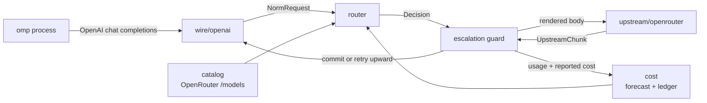

# auto-model-router

A local model router for [Oh My Pi](https://github.com/oh-my-pi). It presents
itself as one keyless OpenAI-compatible provider, then picks a concrete
OpenRouter model **per turn** based on measured price and estimated task
complexity — including mid-conversation, when a session shifts from mechanical
tool-loop churn to genuine reasoning work.

auto-model-router runs **embedded inside the omp process** (as an omp extension) — no
separate server, no orphaned process. It binds a free OS-assigned port and
lives and dies with the omp session.

For non-omp harnesses (Hermes, Claude, any OpenAI-compatible client), run it as
a standalone process with `auto-model-router serve --port <n>` — the same core,
on a fixed port, owned by you. See [Hermes](#hermes) below.

## Why this exists when OpenRouter already ships routers

OpenRouter has `openrouter/auto` (market-spend classifier) and
`openrouter/pareto-code` (Artificial Analysis coding percentile → cheapest in
tier). Both are opaque, server-side, and — per Pareto's own docs — *"you can't
directly cap cost or latency per request."*

This router exists for the things a prompt classifier structurally cannot do:

| Lever | Why it needs to be local |
| --- | --- |
| **Agent-loop awareness** | OpenRouter sees a prompt. We see omp's tool array, tool-result depth, and whether the previous tool call failed. Most agent turns are mechanical post-tool-result continuations — the largest cost lever in agent traffic, and invisible upstream. |
| **Budget enforcement** | Per-turn, per-conversation, and rolling-24h caps, checked against a **cold-cache forecast** before dispatch, with forced downgrade at the ceiling. |
| **Mid-stream escalation** | Hold the first N tokens; on a malformed tool call, refusal, empty completion, or repeated tool call, abort and re-dispatch upward. omp never observes the failure. |
| **Cache-aware hysteresis** | Switching models forfeits the warm prompt cache. The decision is arithmetic, not vibes: expected saving must beat the forfeited cache-read discount by a configured margin. |
| **Closed-loop trust** | Per-model escalation and error rates from *your* traffic demote cheap-but-flaky models automatically. |
| **Explainability** | Every decision — candidates, rejections, forecasts, reasons — is persisted and replayable via `auto-model-router explain`. |

## Architecture



The router runs in-process inside omp via the `router-embed` extension. The
core never parses a wire format. A front end produces a `NormRequest` and
consumes `UpstreamChunk`s, so a `pi-native` front end can be added later
without touching routing.

### Module map

| Path | Responsibility |
| --- | --- |
| `src/catalog/` | Fetch and normalize OpenRouter `/api/v1/models`: pricing, capability flags, Artificial Analysis quality indices. SQLite-cached with TTL. |
| `src/cost/` | Cost forecasting per candidate; reconciliation against OpenRouter's authoritative `usage.cost`; the spend ledger; per-model trust; rolling blended rate. |
| `src/tokens/` | Token estimation with no tokenizer dependency, self-calibrating from observed `prompt_tokens` per tokenizer family. |
| `src/wire/` | Protocol boundary. `wire/openai/` implements chat completions in and SSE out. |
| `src/router/` | Feature extraction, complexity classification, candidate filtering and scoring, hysteresis, cache-breakpoint placement, budget guard, probe planning. |
| `src/upstream/` | OpenRouter transport: streaming dispatch, `session_id` stickiness, error classification, fallback arrays. |
| `src/config/` | Configuration loading, schema validation, and the built-in defaults. |
| `src/cli/` | `serve`, `stats`, `models`, `explain`, `config` commands. |
| `omp-extension/` | The omp extensions: `router-embed.ts`, `router-toast.ts`, `router-configure.ts`. |

### Two cost numbers, never conflated

- **Predicted** — our arithmetic over the catalog, computed *before* dispatch.
  Drives routing and budget guards. Must model `pricing.overrides` tiers, or
  long conversations are underestimated by ~50% exactly when it matters.
- **Reported** — `usage.cost` from OpenRouter, authoritative after the fact.
  Drives the ledger, `stats`, and prediction-error calibration.

## Installing

No separate Bun install is needed for the embedded path. The standalone
`serve` binary (`npm install -g auto-model-router`) bundles Bun.

Two ways to get the router into omp. The **npm package** is the modern path —
it installs the `auto-model-router` binary and wires the omp extensions; the
**repo-local installer** is for developing against the source.

### Via npm (installs the `auto-model-router` binary)

```bash
npm install -g auto-model-router
```

Then add the shipped extensions to omp's `~/.omp/agent/config.yml`
(`$PI_CODING_AGENT_DIR/config.yml` when that env var relocates the agent dir):

```yaml
# ~/.omp/agent/config.yml
extensions:
  - auto-model-router/omp-extension/router-embed.ts
  - auto-model-router/omp-extension/router-toast.ts      # optional: chosen-model toasts
  - auto-model-router/omp-extension/router-configure.ts # optional: /router command
```

### From the repo (cross-platform installer)

```bash
bun tools/install.ts
```

It wires the auto-model-router extensions into omp's `~/.omp/agent/config.yml`
(`$PI_CODING_AGENT_DIR/config.yml` when that env var relocates the agent dir),
backing up the previous file first. It is idempotent — re-running is a no-op.

Options:

```bash
bun tools/install.ts --no-toast --no-configure   # only the required embed extension
```

The installer adds:

- `router-embed.ts` — **required**; runs the router in-process.
- `router-toast.ts` — optional; chosen-model toasts.
- `router-configure.ts` — optional; the `/router` command.

Or add the paths by hand to omp's `~/.omp/agent/config.yml`:

```yaml
# ~/.omp/agent/config.yml
extensions:
  - /path/to/auto-model-router/omp-extension/router-embed.ts
  - /path/to/auto-model-router/omp-extension/router-toast.ts      # optional: chosen-model toasts
  - /path/to/auto-model-router/omp-extension/router-configure.ts # optional: /router command
```

Then restart the omp session (extensions load at session start).

or install it from the marketplace (see below). The plugin declares all three
extensions (`router-embed`, `router-toast`, `router-configure`), so installing
it wires the router in without editing `config.yml` by hand.

### Install from the marketplace

This repo doubles as its own marketplace: it ships a catalog at
`.omp-plugin/marketplace.json` listing the `auto-model-router` plugin. Add the repo as
a marketplace source, then install the plugin:

```bash
omp plugin marketplace add drewappling/auto-model-router
omp plugin install auto-model-router@auto-model-router
```

or in the TUI:

```
/marketplace add drewappling/auto-model-router
/marketplace install auto-model-router@auto-model-router
```

After installing, restart the omp session (extensions load at session start),
then `/model` and pick `auto-model-router/auto`.

### Install from the Pi package marketplace

The repo is also a Pi package (see the `pi` manifest and `pi-package` keyword
in `package.json`), so it can be installed with the Pi CLI and listed on
[pi.dev/packages](https://pi.dev/packages):

```bash
pi install npm:auto-model-router
```

or from git:

```bash
pi install git:github.com/drewappling/auto-model-router
```

#### Releasing

Cut releases with `npm version` (or `bun run release <patch|minor|major>`), not a
bare `npm publish`:

```bash
npm version patch && git push --follow-tags   # or: bun run release patch
```

`npm version` runs the `version` lifecycle script
(`tools/sync-marketplace-version.ts`), which rewrites the Git-marketplace
catalog (`.omp-plugin/marketplace.json`) to the new version and stages it into
the version commit — so the npm package and the marketplace catalog can never
drift. Pushing the `vX.Y.Z` tag triggers the release workflow (npm publish,
which auto-indexes on pi.dev/packages, plus a GitHub Release). A bare
`npm publish` skips both the catalog sync and the tag, so avoid it.

### Hermes

Install the router globally (puts the `serve` binary on PATH) and
install the native plugin, then point Hermes at it:

**1. Install the router binary:**

```bash
npm install -g auto-model-router
```

**2. Install the Hermes plugin.** Copy `hermes-plugin/` to
`$HERMES_HOME/plugins/model-providers/auto-model-router/` (where
`HERMES_HOME` is `C:\Users\<you>\AppData\Local\hermes` on Windows,
`~/.hermes` on macOS/Linux):

```bash
mkdir -p "$HERMES_HOME/plugins/model-providers"
cp -r hermes-plugin/ "$HERMES_HOME/plugins/model-providers/auto-model-router/"
```

**3. Surface the provider in Hermes's picker.** Hermes only lists providers
that have a credential. The router itself is keyless (it resolves its own
OpenRouter key), but to make Hermes show it as selectable, add a marker value
to `$HERMES_HOME/.env`:

```bash
echo "AUTO_MODEL_ROUTER_API_KEY=local" >> "$HERMES_HOME/.env"
```

**4. Restart Hermes.** On load, the plugin spawns the router (`auto-model-router
serve`) as a subprocess on port 8788 and registers the provider profile. Select
`auto-model-router/auto` as the model.

The plugin runs the router against its **own** config home
(`$HERMES_HOME/auto-model-router/`), separate from omp's
`~/.auto-model-router/`, so the two harnesses never share a ledger or
conversation state and don't leak routing toasts into each other's UIs.

The router serves `GET /v1/models` (returning the `auto`, `auto-cheap`,
`auto-max` profiles) and `POST /v1/chat/completions`, which Hermes's custom
endpoint discovery verifies. The router's own OpenRouter key resolution
(config → env → omp auth store) applies — Hermes does not need its own
OpenRouter key.

**Standalone alternative (no plugin):** run the router yourself, then add a
custom provider:

```bash
auto-model-router serve --port 8788
```

```yaml
# $HERMES_HOME/config.yaml
providers:
  auto-model-router:
    base_url: http://127.0.0.1:8788/v1
    api_key: local
    default_model: auto
```

### The OpenRouter key

**omp does not need to be authenticated to OpenRouter.** On a routed turn omp
never calls OpenRouter directly: the embed extension registers the
`auto-model-router` provider with a placeholder bearer (`embedded`) pointing at
the in-process router, and the router holds the real OpenRouter key and makes
the upstream call. omp only needs to see that the provider "has credentials",
which the placeholder satisfies.

There should be exactly one OpenRouter key on the machine. The router resolves
it in this order:

1. `openrouter.apiKey` in `$AUTO_MODEL_ROUTER_HOME/config.yml` — router-owned,
   never enters omp's environment. Set it with `auto-model-router config` or by
   hand.
2. `OPENROUTER_API_KEY` in the environment omp launches from (including any
   `.env` omp loaded).
3. **omp's own auth store** — `~/.omp/agent/agent.db`, provider `openrouter`, so
   `/login openrouter` inside omp is sufficient and nothing needs copying.

Options 1–2 give the router its own key with omp left unauthenticated; option 3
is a zero-config convenience for when you *have* logged omp in. The store is
opened read-only and never written: omp owns it, including OAuth refresh. An
expired OAuth access token is rejected rather than sent, because refreshing is
omp's job and a stale bearer just burns a turn on a 401. Under
`OMP_AUTH_BROKER_URL` the local store is not consulted at all, since a broker
replaces it.

The embedded router reports the key source via its in-process `GET /health`
(`config` | `env` | `omp-auth-store` | `none`) — never the key itself.

---

## How it runs

At session start, the **main** omp session's `router-embed.ts`:

1. binds a **free OS-assigned port** (`Bun.serve({ port: 0 })`) so several omp
   sessions never collide on a fixed port;
2. writes the actual bound port to the shared `$AUTO_MODEL_ROUTER_HOME/embed.port`;
3. registers an `auto-model-router` provider with omp (`auto`, `auto-cheap`, `auto-max`
   virtual models) pointing at `http://127.0.0.1:$PORT/v1`.

Subagents do **not** bind their own router. They are ephemeral worker processes
whose PIDs get recycled, so a per-process port file is a race. Instead every
subagent registers the same shared provider and routes to the main session's
single router, whose port lives in the one shared `embed.port` file — one
authoritative writer, no stale per-PID port.

The router lives and dies with the main omp session — no orphan process, no "is
the server running?" stopping the omp process frees the port automatically.

### Multiple omp sessions, one machine

Each top-level omp session binds its own router on its own ephemeral port, so
they never conflict. The `X-Omp-Harness` header (from `server.harnessId`)
scopes budgets, toasts, and optional trust per harness.

---

## Selecting the provider / model

The router registers three virtual models under the `auto-model-router` provider:

| Profile | Min tier | Max tier | Use |
| --- | --- | --- | --- |
| `auto` | trivial | hard | Default — routes by complexity across the whole range. |
| `auto-cheap` | trivial | simple | Cost-first — caps at the `simple` tier. |
| `auto-max` | moderate | hard | Quality-first — never below `moderate`. |

Select one in omp via `/model` and pick `auto-model-router/auto` (or one of the
others). Or set it as the default for a role in `~/.omp/agent/config.yml`:

```yaml
modelRoles:
  default: auto-model-router/auto
```

The router decides the concrete OpenRouter model **per turn**; omp only sees the
virtual profile it picked. Every routed response carries
`x-auto-model-router-model`, `x-auto-model-router-tier`, `x-auto-model-router-cost-usd`, and
`x-auto-model-router-attempts`.

---

## Configuring the router

The router's own config lives at `$AUTO_MODEL_ROUTER_HOME/config.yml` (default
`~/.auto-model-router/config.yml`). Every key is optional — unset keys use the
built-in defaults below. There are two ways to edit it:

### Via `/router` (in-omp, native UI)

Install the `router-configure` extension, restart omp, then run `/router` in
the session prompt. It shows a section picker (Server, OpenRouter, Tiers,
Tasks, Filters, Classifier, Escalation, Hysteresis, Cache, Budget, Ledger,
Logging, Profiles). Each field prompts through omp's native UI dialogs —
empty input keeps the current value, `-` clears an optional field. `Save and
exit` writes the merged config (schema-checked and backed up first). Restart
the omp session after saving.

### Via `auto-model-router config` (text wizard / CLI)

```bash
auto-model-router config
```

Same fields, prompted on the terminal. Also:

- `auto-model-router config --print` — prints the OpenAI-compatible provider block ready to paste into `models.yml` or your harness config.
- `auto-model-router config --write` — merges that block into omp's `models.yml` automatically.

Both write paths validate the merged file against the schema before touching
disk and back up the previous file to a timestamped `.bak`.
### Configuration file location

- Router config: `$AUTO_MODEL_ROUTER_HOME/config.yml` (default `~/.auto-model-router/config.yml`).
- Ledger DB: `$AUTO_MODEL_ROUTER_HOME/router.db` (SQLite, WAL).

### Environment variables

| Variable | Purpose | Default |
| --- | --- | --- |
| `OPENROUTER_API_KEY` | OpenRouter key (overrides the auth store). | — |
| `AUTO_MODEL_ROUTER_HOME` | Config + database directory. | `~/.auto-model-router` |
| `AUTO_MODEL_ROUTER_HOST` | Bind address override. | `127.0.0.1` |
| `AUTO_MODEL_ROUTER_LOG` | Log level: `silent`/`error`/`warn`/`info`/`debug`. | `info` |
| `AUTO_MODEL_ROUTER_LOG` | Log level: `silent`/`error`/`warn`/`info`/`debug`. | `info` |
| `AUTO_MODEL_ROUTER_DB` | Override the ledger path. | `$AUTO_MODEL_ROUTER_HOME/router.db` |
| `AUTO_MODEL_ROUTER_URL` | Toast/base URL override (the toast reads the shared port file first). | — |
| `AUTO_MODEL_ROUTER_API_KEY` | Client bearer for the toast poll when `server.apiKey` is set. | — |
| `OMP_HARNESS_ID` | Per-harness toast scoping. | — |

---

## Configuration reference

This is the complete set of settings, grouped by section, with defaults and
what each one does. All values are optional; omit a key to use its default.

### `server`

| Key | Default | Meaning |
| --- | --- | --- |
| `host` | `127.0.0.1` | Bind address. `0.0.0.0`/`::` listen on all interfaces (the provider still advertises loopback). |
| `port` | `0` | Bind port. `0` = let the OS pick a free ephemeral port (the embedded router's default). |
| `apiKey` | unset | Optional client bearer token. When set, every request must send `Authorization: Bearer <key>`. |
| `harnessId` | unset | Harness identity sent as `X-Omp-Harness`; scopes per-harness daily budgets and toasts. |

### `openrouter`

| Key | Default | Meaning |
| --- | --- | --- |
| `baseUrl` | `https://openrouter.ai/api/v1` | Upstream OpenRouter endpoint. |
| `apiKey` | unset | OpenRouter key. Falls back to `OPENROUTER_API_KEY`, then omp's auth store. |
| `referer` | unset | HTTP `Referer` header sent upstream (OpenRouter attribution). |
| `title` | `auto-model-router` | Attribution title sent upstream. |
| `timeoutMs` | `600000` (10 min) | Upstream request timeout. Agent turns stream for minutes, so keep this high. |
| `catalogTtlMs` | `21600000` (6 h) | How long the model catalog is cached before a forced refetch. |
| `catalogRefreshMs` | `300000` (5 min) | Background catalog refetch interval; `0` disables it. |

### `tiers` — per-tier economic envelope

Each tier (`trivial`, `simple`, `moderate`, `hard`) is a `tierConfig`:

| Key | Default | Meaning |
| --- | --- | --- |
| `minQuality` | `0/40/60/72` | Minimum quality score (on the task's axis) a model needs to be eligible. `0` admits unscored models. |
| `maxInputPerMtok` | `0.3/1.5/4.0` (hard: none) | Price ceiling on input, USD per million tokens. `hard` has no ceiling. |
| `maxOutputPerMtok` | unset | Optional output price ceiling, USD per million tokens. |
| `qualityExponent` | `0/0/1/3` | How strongly quality beats price when ranking candidates. `0` = cheapest above the floor; higher = prefer quality. |
| `pin` | `[]` | Force specific model slugs into this tier (they bypass the floor/ceiling). |

### `tasks` — per-task-type capability and quality

Each task (`coding`, `vision`, `documentation`, `data`, `chat`) is a
`taskConfig`:

| Key | Default | Meaning |
| --- | --- | --- |
| `axis` | coding→`coding`, others→`intelligence` | Which quality axis to score on. |
| `minQuality` | unset | RAISES the tier floor for this task (never relaxed by adaptive floors). |
| `requireImage` | vision: `true`, others unset | Require image input support. |
| `prefer` | `[]` | Preferred model slugs for this task. |

### `filters` — candidate allow/deny and trust

| Key | Default | Meaning |
| --- | --- | --- |
| `allow` | `[]` | Glob allowlist; when non-empty, only matching slugs are eligible. |
| `deny` | `[]` | Glob denylist; matching slugs are excluded. |
| `includeFree` | `false` | Include free models (rate-limited hard; usually excluded). |
| `requireToolSupport` | `true` | Only models that support tool calls. |
| `minTrust` | `0.7` | Minimum success rate; models below this (after `minTrustSamples`) are demoted. |
| `minTrustSamples` | `12` | Attempts before trust is enforced. |
| `trustScopedByHarness` | `false` | `true` = each harness reads only its own trust rows. |
| `contextHeadroom` | `1.25` | Fraction of context kept free (a model must fit prompt × this). |

### `classifier` — complexity adjudication

| Key | Default | Meaning |
| --- | --- | --- |
| `ambiguityThreshold` | `0.6` | Below this heuristic confidence, the adjudicator model decides the tier. |
| `model` | `qwen/qwen3.7-flash` | Adjudicator model slug. |
| `maxCostFraction` | `0.02` | Adjudicator cost cap as a fraction of the turn's budget. |
| `maxCostUsd` | `0.002` | Absolute adjudicator cost cap, USD. |
| `timeoutMs` | `4000` | Adjudicator request timeout. |
| `cacheSize` | `512` | Adjudication result cache size. |
| `toolAxis` | `coding` | Quality axis for tool-heavy turns. |
| `chatAxis` | `intelligence` | Quality axis for chat turns. |
| `agenticLoopDepth` | `3` | Tool-loop depth at which a turn is treated as agentic. |

### `escalation` — mid-stream retry upward

| Key | Default | Meaning |
| --- | --- | --- |
| `enabled` | `true` | Enable the mid-stream escalation guard. |
| `probeTokens` | `48` | Tokens held before deciding whether to escalate. |
| `maxHoldMs` | `8000` | Max time to hold the first tokens waiting for a verdict. |
| `maxAttempts` | `3` | Original try + retries. Direct dial between reliability and wasted spend. |
| `probeTiers` | `["trivial","simple","moderate"]` | Tiers that may escalate upward (`hard` has nowhere to go). |
| `triggers` | 5 signals | `malformed_tool_args`, `refusal`, `empty_completion`, `repeat_tool_call`, `missing_expected_tool_call`. |
| `escalateOnLengthStop` | `true` | Escalate on a `length` finish that truncated tool-call args. |

### `hysteresis` — cache-aware model stickiness

| Key | Default | Meaning |
| --- | --- | --- |
| `holdTurns` | `2` | Hold a chosen model this many turns before it can downgrade. |
| `holdTurnsAfterEscalation` | `4` | Hold longer after an escalation. |
| `switchMargin` | `1.3` | Switching must beat the warm-cache discount by this factor. Lower = switch away from a warm model more readily. |
| `cacheWarmTtlMs` | `300000` (5 min) | How long a model's prompt cache is considered warm. |
| `maxDowngradePerTurn` | `1` | Max tiers a turn may drop in one step (avoids quality cliffs). |

### `cache` — prompt-cache breakpoints

| Key | Default | Meaning |
| --- | --- | --- |
| `injectBreakpoints` | `true` | Insert prompt-cache breakpoints into long prompts. |
| `maxBreakpoints` | `4` | Max breakpoints (Anthropic allows 4; OpenRouter translates). |
| `minPromptTokens` | `2048` | Minimum prompt size before breakpoints are injected. |

### `budget` — cost caps

| Key | Default | Meaning |
| --- | --- | --- |
| `perTurnUsd` | unset | Per-turn cap (checked against the cold forecast). |
| `perConversationUsd` | unset | Per-conversation cap. |
| `perDayUsd` | unset | Rolling 24h cap, scoped per harness when `harnessId` is set. |
| `onExceeded` | `downgrade` | `downgrade` = pick the cheapest viable model; `reject` = fail the turn. |

### `profiles` — the virtual models omp sees

Each profile is a complete entry (arrays replace wholesale):

| Key | Default | Meaning |
| --- | --- | --- |
| `id` | `auto` / `auto-cheap` / `auto-max` | Model id omp selects. |
| `name` | `Auto (auto-model-router)` etc. | Display name. |
| `minTier` / `maxTier` | `trivial`/`hard`, `trivial`/`simple`, `moderate`/`hard` | Tier envelope. |
| `contextWindow` | `400000` | Advertised context window (drives omp's compaction). |
| `maxTokens` | `32000` | Advertised max output tokens. |
| `budget` | unset | Per-profile budget overrides. |

### `ledger` — cost measurement

| Key | Default | Meaning |
| --- | --- | --- |
| `path` | `$AUTO_MODEL_ROUTER_HOME/router.db` | SQLite ledger path. |
| `blendWindowDays` | `7` | Window for the blended cost rate. |
| `blendMinSamples` | `25` | Turns before the measured blend replaces the fallback. |
| `fallbackBlend` | input `1.5`, output `7.5` | Pre-measurement blend (USD/Mtok) for omp's cost display. |
| `conversationTtlMs` | `604800000` (7 d) | Drop conversation state untouched this long. |

### Top-level

| Key | Default | Meaning |
| --- | --- | --- |
| `adaptiveTierFloors` | `true` | Derive tier floors from the models actually available (relaxing, never raising, the configured floors). |
| `logLevel` | `info` | `silent`/`error`/`warn`/`info`/`debug`. |

## Multiple coding harnesses, one router

A single embedded router can serve several omp sessions without them stepping
on each other:

- **Per-conversation routing** (hysteresis, cache warmth, escalation, spend) is
  keyed by conversation, so different sessions isolate naturally.
- **Per-harness daily budget** — each harness sends an `X-Omp-Harness` header
  (from the provider block's `headers:`), and the router scopes the rolling
  24h `perDayUsd` ceiling to it. One harness can't exhaust the day for another.
- **Per-session toasts** — the toast surfaces only the decisions made by *its
  own* omp session. The embed extension tags every request with an
  `X-Omp-Session` header (`ctx.sessionManager.getSessionId()`), the router
  records it on each ledger row, and the toast filters on it. Two concurrent
  interactive sessions — even of the same harness — never surface each other's
  model choices. This needs no configuration.
- **Per-harness toasts** — additionally set `OMP_HARNESS_ID` to the same value
  so the extension only toasts that harness's model choices. Session scoping is
  finer-grained; harness scoping still applies on top when set.

Configure a harness by setting `server.harnessId`; set the same id in that
harness's `OMP_HARNESS_ID` env var.

**Model trust is shared by default** (`filters.trustScopedByHarness: false`):
every harness's attempts count toward each model's reliability score, so the
demotion guard converges on more samples and stays effective even with a small
guardrail-narrowed catalog. Enable `trustScopedByHarness: true` to read each
harness's reliability from only its own ledger rows.

---

## Shared project context across model switches (agentdox)

Switching models mid-conversation loses more than a prompt cache: the new model
has none of the project knowledge the last one built up. Because every harness
routes through this one provider, the router is the single place that can fix
that for all of them at once.

Point it at an [agentdox](https://github.com/…/agentdox) server and every turn —
whatever model wins the routing decision — carries the same project memory, docs,
and brief:

```bash
export AGENTDOX_URL=http://localhost:3003
export AGENTDOX_TOKEN=<pat with read+write on the scope>
export AGENTDOX_SCOPE=ashlands        # fallback only; see below
```

Setting a URL and a token is enough to turn it on.

The scope is **derived per workspace** from the directory basename
(`E:/projects/ashlands` → `ashlands`), and that derivation wins. `AGENTDOX_SCOPE` /
`context.defaultScope` is only a fallback for workspaces it cannot resolve, because one router
install serves every project on the machine — a slug pinned there would be sent for all of
them, injecting one project's context into another's work. A single configured token also
grants only the scopes it was minted for; for any other project the bridge degrades to inert
rather than writing somewhere wrong.

### It does not cost you a cache miss per turn

The context block sits at the front of the prompt, so re-fetching it every turn
would invalidate the cached prefix every turn — costing far more than routing
saves. Instead a block is **pinned per conversation** and refreshed only when the
prefix is already cold:

| Trigger | Cache cost |
| --- | --- |
| First turn of a conversation | none — nothing is warm yet |
| The router switches model | none — already forfeited by the switch |
| Escalation or failover retry | none — a new dispatch is cold anyway |
| Staleness TTL (`context.maxStalenessMs`, default 900s) | paid once |

Between those moments the identical bytes are re-injected and the cache holds.
The refresh rides on a cache miss that was happening regardless — which is why
"context follows the model switch" is nearly free.

A block is versioned by **content hash**, not by agentdox's `assembledAt`.
agentdox re-assembles on a timer, so a timestamp would change on every tick and
break a warm cache for nothing; an unchanged re-assembly hashes identically and
costs nothing.

The block is appended to the **last system message** rather than inserted as a
new one, so the cache-breakpoint indices the core computed stay valid and the
block lands inside the prefix `planCacheBreakpoints` already marks.

### Turns are recorded back, attributed to the model that served them

With `context.recordTurns` (default on), each settled turn is written to an
agentdox session tagged `model:<slug>` and `tier:<tier>` — a transcript that
shows which model produced which turn. Those messages feed back into the next
`context_assemble`, so the model you switch *to* inherits what the model you
switched *from* actually did.

A recorded turn is the whole **user-visible** turn, not one record per upstream
request. An agentic turn is a loop of dispatches — each tool round-trip finishes
with `tool_calls` and emits almost no text, and the last user message does not
move while the loop runs. So the router buffers the assistant's narration across
the loop and writes it once, together with the closing synthesis, when the
assistant actually yields back to the user.

Write-backs are queued, bounded, and never awaited: agentdox is an enrichment,
not a dependency. If it is unreachable the turn routes and dispatches normally,
and a pinned block keeps being served.

`GET /health` reports the bridge's URL, default scope, and `recordTurns` — never
the token. Design notes: `docs/architecture/router-context-bridge.md` in the
agentdox repo. Live check: `bun tools/agentdox-e2e.ts`.

---

## Toast notifications for the chosen model

auto-model-router is headless and cannot draw into omp's TUI, so chosen-model toasts
come from a small omp extension that polls the router's in-process ledger:

```ts
// omp-extension/router-toast.ts  (shipped in this repo)
```

It raises a TUI toast (`ctx.ui.notify`) like
`meta/muse-glimmer-30b [trivial] · $0.00001` whenever a new model is chosen.
Install it by adding the file's absolute path to omp's `extensions:` list.

Because the embedded router binds a random port, the toast resolves the router
base URL on every poll in this order: the embedded router's port file
(`$AUTO_MODEL_ROUTER_HOME/embed.port`), then `AUTO_MODEL_ROUTER_URL`, then `AUTO_MODEL_ROUTER_PORT`,
then the router's own `config.yml`, then `http://127.0.0.1:8788`. Reading the
port file each tick means the toast always polls the port the router actually
bound, even though it changes every session.

The toast logic is a pure, unit-tested module
(`omp-extension/toast-logic.ts`, covered by `test/toast-logic.test.ts`): it
toasts only decisions newer than the last seen one, skips `wasted` escalation
attempts, prefers the actual serving slug over the requested one, and filters
to the toast's own omp session id (and harness id, when set).

---

## Verifying

```bash
bun run typecheck   # strict, exactOptionalPropertyTypes + noUncheckedIndexedAccess
bun test            # unit suite
bun run smoke       # end-to-end against a scriptable mock OpenRouter
```

`bun smoke` starts the embedded router against `tools/mock-openrouter.ts`, which
serves a genuine catalog fixture and synthesizes OpenRouter-shaped SSE. It
asserts the properties that matter: no `openrouter/*`, `~alias`, `:batch`, or
`stealth/*` slug is ever selected; a mechanical tool-result continuation routes
to a cheaper tier than an architecture question in the same conversation; a
malformed tool call is escalated to a stronger model without the client ever
seeing the failure; and the abandoned attempt is booked as wasted spend.

### Diagnostic CLI: `explain`

`auto-model-router explain --file request.json` routes a saved request offline and prints the
complete decision trace without dispatching a completion:

- **Features:** token counts, toolLoopDepth, code fence markers, image presence.
- **Classification:** chosen tier, confidence, rule hits, complexity reasoning.
- **Candidates:** ranked models with price forecasts, latency penalties, quality scores.
- **Rejections:** every filtered model and the exact constraint that excluded it (`over_price_ceiling`, `below_quality_floor`, `untrusted`, `context_length`).

Use it to debug unexpected tier selections or to see why a model was excluded in seconds.
---

## Where quality scores come from

Tier floors are points on the Artificial Analysis index, which OpenRouter
publishes per model under `benchmarks.artificial_analysis` (coding, agentic and
intelligence). Two things about that data drive the router's behaviour:

**`/models/user` omits it entirely.** The key-scoped endpoint is authoritative
for *availability* under your guardrails, but its records carry no `benchmarks`
block. Read on its own it makes every model **unscored**, and an unscored model
satisfies no floor above zero — so `simple`, `moderate` and `hard` all go
permanently empty, selection widens down, and every turn is served by the
cheapest `trivial` model no matter how hard the work is. The router therefore
fetches the public `/models` purely to join the scores back on by id.
Availability still comes solely from the key-scoped list. The join is
best-effort: if the public fetch fails, the catalog stays unscored and degraded
rather than the refresh failing.

**Roughly 60% of the catalog is unscored anyway.** Scores are never imputed
from price, so unscored models are only ever eligible where the floor is zero.

---

## Adaptive tier floors

The configured floors (`trivial` 0, `simple` 40, `moderate` 60, `hard` 72) are
absolute points tuned against the full ~420-model catalog. A guardrail can
narrow your available set to models that all sit below them, at which point an
absolute floor admits nothing and the router is trapped in the lowest tier.

With `adaptiveTierFloors: true` (the default), every catalog refresh ranks the
**available** scored models and splits them into four quantile bands, taking
each band's lower bound as that tier's adaptive floor. The floor actually
enforced is `min(configured, adaptive)`:

- a healthy catalog keeps the configured floors verbatim — no behaviour change;
- a narrowed catalog falls back to the adaptive floor, so `hard` still gets the
  best quartile of what is available instead of nothing.

Relaxation is one-directional by design: an adaptive floor may only **lower** a
tier floor, never raise one. Two things are deliberately exempt:

- **Task floors are never relaxed.** `tasks.*.minQuality` is a capability
  requirement (vision needs a model that can actually see), not an economic
  envelope, so the effective floor is `max(taskFloor, adaptiveTierFloor)`.
- **Unscored catalogs relax to zero.** With no measured spread to rank on, all
  four floors compute to 0 and the price ceiling plus `qualityExponent` do the
  differentiating.

`auto-model-router models` shows any relaxation explicitly:

```
[hard]  quality floor 95 → 76.1 (adaptive) on the coding axis  -  3 eligible, 16 excluded
```

---

## Raising quality for coding work

Tier floors are economic envelopes; `tasks.*.minQuality` is the knob for "I
want coding turns to use competent models regardless of tier". It RAISES the
floor at every tier and is never relaxed by adaptive floors, while the tier
price ceilings still cap what each tier may spend:

```yaml
tasks:
  coding:
    axis: coding
    minQuality: 68
```

`auto-model-router models` names whichever mechanism moved a floor, so a surprising
eligible set is always explainable.

This is usually the right dial for an agentic coding harness. Most turns after
the first are tool-result continuations, which the complexity heuristic scores
as mechanical — correct for a single file read, but it means a long, genuinely
hard session keeps classifying `trivial`. A task floor lifts the quality of
whatever tier is chosen without forcing every turn into an expensive tier.

---

## Tier rescue

The tier envelopes (price ceilings, quality floors, trust bar) are tuned against
the full catalog, but OpenRouter guardrails can shrink a key's *available* set
down to a handful of models — all of which may fail every strict tier. When that
happens the router does not fail the turn; it progressively relaxes the
economic constraints (price ceilings → quality floors → trust bar) until some
**available** model qualifies. The hard capability filters (tool/image/context
support) and the key-scoped allowlist are never lifted, so the rescue can never
select a model the key cannot serve. Every rescue is recorded in the decision
trail (`tier rescue: strict config excluded all available models; relaxed …`).

## Status

Working end to end against a live `OPENROUTER_API_KEY` and a guardrail-limited
account; contracts are frozen in `src/**/types.ts`.

Known gaps:

- The `pi-native` front end is designed for but not implemented; only the
  OpenAI-compatible wire exists today.
- Blended `cost` figures in `models.yml` are refreshed by re-running
  `auto-model-router config --write`, not automatically.

## License

MIT License. See [LICENSE](LICENSE) for the full text.

Copyright (c) 2026 drewappling. Released under the MIT License — free to use,
modify, and distribute, including commercially, provided the copyright notice
is preserved.
