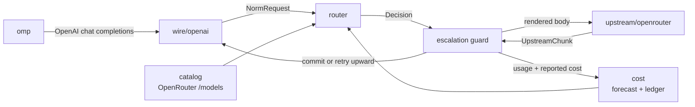

# omp-router

A local model router for [Oh My Pi](https://github.com/oh-my-pi). It presents
itself as one keyless OpenAI-compatible provider, then picks a concrete
OpenRouter model **per turn** based on measured price and estimated task
complexity — including mid-conversation, when a session shifts from mechanical
tool-loop churn to genuine reasoning work.

All LLM inference is offloaded to OpenRouter. Nothing runs on-device except
routing arithmetic.

## Why this exists when OpenRouter already ships routers

OpenRouter has `openrouter/auto` (market-spend classifier) and
`openrouter/pareto-code` (Artificial Analysis coding percentile → cheapest in
tier). Both are opaque, server-side, and — per Pareto's own docs — *"you can't
directly cap cost or latency per request."*

This router exists for the things a prompt classifier structurally cannot do:

| Lever | Why it needs to be local |
| --- | --- |
| **Agent-loop awareness** | OpenRouter sees a prompt. We see omp's tool array, tool-result depth, and whether the previous tool call failed. Most agent turns are mechanical post-tool-result continuations — the largest cost lever in agent traffic, and invisible upstream. |
| **Budget enforcement** | Per-turn, per-conversation, and rolling-24h caps, checked against a **cold-cache forecast** before dispatch, with forced downgrade at the ceiling. |
| **Mid-stream escalation** | Hold the first N tokens; on a malformed tool call, refusal, empty completion, or repeated tool call, abort and re-dispatch upward. omp never observes the failure. |
| **Cache-aware hysteresis** | Switching models forfeits the warm prompt cache. The decision is arithmetic, not vibes: expected saving must beat the forfeited cache-read discount by a configured margin. |
| **Closed-loop trust** | Per-model escalation and error rates from *your* traffic demote cheap-but-flaky models automatically. |
| **Explainability** | Every decision — candidates, rejections, forecasts, reasons — is persisted and replayable via `omp-router explain`. |

## Architecture



The core never parses a wire format. A front end produces a `NormRequest` and
consumes `UpstreamChunk`s, so a `pi-native` front end (omp's lossless canonical
transport, `POST /v1/pi/stream`) can be added later without touching routing.

### Module map

| Path | Responsibility |
| --- | --- |
| `src/catalog/` | Fetch and normalize `GET /api/v1/models`: pricing (including `pricing.overrides` long-context tiers), capability flags, Artificial Analysis quality indices. SQLite-cached with TTL. |
| `src/cost/` | Cost forecasting per candidate; reconciliation against OpenRouter's authoritative `usage.cost`; the spend ledger; per-model trust; rolling blended rate. |
| `src/tokens/` | Token estimation with no tokenizer dependency, self-calibrating from observed `prompt_tokens` per tokenizer family. |
| `src/wire/` | Protocol boundary. `wire/openai/` implements chat completions in and SSE out, with verbatim passthrough of fields the core does not model. |
| `src/router/` | Feature extraction, complexity classification, candidate filtering and scoring, hysteresis, cache-breakpoint placement, budget guard, probe planning. |
| `src/upstream/` | OpenRouter transport: streaming dispatch, `session_id` stickiness, error classification, fallback arrays. |
| `src/server/` | `Bun.serve` HTTP surface. |
| `src/cli/` | `serve`, `stats`, `models`, `explain`, `config`. |

### Two cost numbers, never conflated

- **Predicted** — our arithmetic over the catalog, computed *before* dispatch.
  Drives routing and budget guards. Must model `pricing.overrides` tiers, or
  long conversations are underestimated by ~50% exactly when it matters.
- **Reported** — `usage.cost` from OpenRouter, authoritative after the fact.
  Drives the ledger, `stats`, and prediction-error calibration.

## Setup

```bash
bun install
```

There are two ways to run the router. The primary one runs it **in-process
inside omp** — no separate service, no orphaned process, no "is the server
running?"; it lives and dies with the omp session. The standalone `serve` still
exists for sharing one instance across several harnesses or machines.

### Run it embedded in omp (primary)

Add the embed extension to omp's `extensions:` list, plus the toast extension
if you want chosen-model toasts:

```yaml
# ~/.omp/agent/config.yml
extensions:
  - /path/to/omp-router/omp-extension/router-embed.ts
  - /path/to/omp-router/omp-extension/router-toast.ts
```

At session start the embed extension:

- starts the router **inside the omp process**, binding a **free OS-assigned
  port** (`Bun.serve({ port: 0 })`) so several omp sessions can run at once
  without ever colliding on a fixed port;
- writes the actual bound port to `$OMP_ROUTER_HOME/embed.port` so the toast
  extension can find it;
- registers an `omp-router` provider with omp (the `auto`, `auto-cheap`,
  `auto-max` models) pointing at `http://127.0.0.1:$PORT/v1`, where `$PORT`
  is the port it actually bound.

Set `OMP_ROUTER_PORT` to pin a specific port instead of a random one (rarely
needed). The router lives and dies with the session — no orphan process, no
"is the router running?" The `X-Omp-Harness` header (from `server.harnessId`)
scopes budgets, toasts, and optional trust per harness.

### Run it as a separate service

```bash
bun run serve   # binds 127.0.0.1:8788 by default
```

Do not run `bun run serve` and the embed extension in the same process
namespace on the same port — that is a bind conflict.

### The OpenRouter key

There should be exactly one OpenRouter key on the machine, and omp already owns
a credential store. Resolution order:

1. `openrouter.apiKey` in `$OMP_ROUTER_HOME/config.yml`
2. `OPENROUTER_API_KEY` (including any `.env` omp loaded into the environment)
3. **omp's own auth store** — `~/.omp/agent/agent.db`, provider `openrouter`

So `/login openrouter` inside omp is sufficient setup; nothing needs copying.
The store is opened read-only and never written: omp owns it, including OAuth
refresh. An expired OAuth access token is rejected rather than sent, because
refreshing is omp's job and a stale bearer just burns a turn on a 401. Under
`OMP_AUTH_BROKER_URL` the local store is not consulted at all, since a broker
replaces it.

The standalone `serve` prints the key provenance at startup and `GET /health`
reports `apiKeySource` (`config` | `env` | `omp-auth-store` | `none`) — never
the key itself.

## Toast notifications for the chosen model

omp-router is headless and cannot draw into omp's TUI, so chosen-model toasts
come from a small omp extension that polls the router's decision ledger:

```ts
// omp-extension/router-toast.ts  (shipped in this repo)
```

It raises a TUI toast (`ctx.ui.notify`) like
`meta/muse-glimmer-30b [trivial] · $0.00001` whenever a new model is chosen.
Install it by adding the file's absolute path to omp's `extensions:` list
(alongside the embed extension above):

```yaml
# ~/.omp/agent/config.yml
extensions:
  - /path/to/omp-router/omp-extension/router-embed.ts
  - /path/to/omp-router/omp-extension/router-toast.ts
```

Then restart the omp session (extensions load at session start). Because the
embedded router binds a random OS-assigned port, the toast resolves the router
base URL on every poll in this order: the embedded router's port file
(`$OMP_ROUTER_HOME/embed.port`), then `OMP_ROUTER_URL`, then `OMP_ROUTER_PORT`,
then the router's own `config.yml`, then `http://127.0.0.1:8788`. Reading the
port file each tick means the toast always polls the port the router actually
bound, even though it changes every session.

The toast logic is a pure, unit-tested module
(`omp-extension/toast-logic.ts`, covered by `test/toast-logic.test.ts`): it
toasts only decisions newer than the last seen one, skips `wasted` escalation
attempts, and prefers the actual serving slug over the requested one.

## Multiple coding harnesses, one router

A single router instance can serve several omp sessions (or other OpenAI-
compatible harnesses) without them stepping on each other:

- **Per-conversation routing** (hysteresis, cache warmth, escalation, spend) is
  keyed by conversation, so different sessions isolate naturally.
- **Per-harness daily budget** — each harness sends an `X-Omp-Harness` header
  (from the provider block's `headers:`), and the router scopes the rolling
  24h `perDayUsd` ceiling to it. One harness can't exhaust the day for another.
- **Per-harness toasts** — set `OMP_HARNESS_ID` to the same value so the
  extension only toasts that harness's model choices.

Configure a harness by setting `server.harnessId` and re-running
`omp-router config --write` (it emits the header); set the same id in that
harness's `OMP_HARNESS_ID` env var.

**Model trust is shared by default** (`filters.trustScopedByHarness: false`):
every harness's attempts count toward each model's reliability score, so the
demotion guard converges on more samples and stays effective even with a small
guardrail-narrowed catalog. Enable `trustScopedByHarness: true` to read each
harness's reliability from only its own ledger rows — recommended only when
harnesses route over meaningfully different model sets and each has enough
traffic to learn its own reliability.


## Configuring the router

`omp-router config` opens an interactive wizard over the router's own config
(`$OMP_ROUTER_HOME/config.yml`, default `~/.omp-router/config.yml`). It covers
every section — server, openrouter, tiers, tasks, filters, classifier,
escalation, hysteresis, cache, budget, ledger, logging — plus the `profiles`
list (add, edit, delete the virtual models omp sees).

```
omp-router config

   1) Server            7) Escalation
   2) OpenRouter        8) Hysteresis
   3) Tiers             9) Cache
   4) Tasks            10) Budget
   5) Filters          11) Ledger
   6) Classifier       12) Logging

   p) Profiles
   a) walk every section
   s) save and exit
   q) quit without saving
```

At a field prompt the current value is shown in brackets:

- **Enter** keeps it (nothing is written)
- **`-`** clears an optional field, so the built-in default applies again
- anything else is validated against the field's type and range, and re-prompts
  on bad input

Only the fields you actually change are written, as a minimal deep-merge
partial, so hand-edited values and comments elsewhere in the section survive.
The **merged** file is validated against the config schema before anything is
written, and the previous file is copied to a timestamped `.bak` first. A clear
deletes the key outright rather than writing `null`, and prunes the section if
it ends up empty.

`--config <path>` targets a different config file; the wizard is scriptable
because it reads plain lines from stdin.

Register it with omp (`omp-router config --print` prints this block; `--write`
merges it into `~/.omp/agent/models.yml` between guard comments, after a backup):

```yaml
providers:
  omp-router:
    baseUrl: http://127.0.0.1:8788/v1
    api: openai-completions
    auth: none
    models:
      - id: auto
        name: Auto (omp-router)
        # ...contextWindow, maxTokens, and a blended `cost` derived from your ledger
```

## HTTP surface

| Route | Purpose |
| --- | --- |
| `POST /v1/chat/completions` | Routed completion, streaming or buffered. |
| `GET /v1/models` | Virtual profiles (`auto`, `auto-cheap`, `auto-max`). |
| `GET /v1/router/stats` | Spend, per-model breakdown, escalation and trust rates. |
| `GET /v1/router/decisions` | Recent decisions with full reasoning. |
| `GET /health` | Liveness plus catalog freshness. |

Every routed response carries `x-omp-router-model`, `x-omp-router-tier`,
`x-omp-router-cost-usd`, and `x-omp-router-attempts`.

## Verifying

```bash
bun run typecheck   # strict, exactOptionalPropertyTypes + noUncheckedIndexedAccess
bun test            # unit suite
bun run smoke       # end-to-end against a scriptable mock OpenRouter
```

`bun run smoke` starts the real server against `tools/mock-openrouter.ts`, which
serves the genuine 147-model catalog fixture and synthesizes OpenRouter-shaped
SSE. It asserts the properties that matter: no `openrouter/*`, `~alias`,
`:batch`, or `stealth/*` slug is ever selected; a mechanical tool-result
continuation routes to a cheaper tier than an architecture question in the same
conversation; a malformed tool call is escalated to a stronger model without the
client ever seeing the failure; and the abandoned attempt is booked as wasted
spend.

`omp-router explain --file request.json` routes a saved request and prints the
feature vector, classification reasoning, ranked candidates with forecasts, and
every rejection with its cause — without dispatching a completion.

## Where quality scores come from

Tier floors are points on the Artificial Analysis index, which OpenRouter
publishes per model under `benchmarks.artificial_analysis` (coding, agentic and
intelligence). Two things about that data drive the router's behaviour:

**`/models/user` omits it entirely.** The key-scoped endpoint is authoritative
for *availability* under your guardrails, but its records carry no `benchmarks`
block at all. Read on its own it makes every model **unscored**, and an unscored
model satisfies no floor above zero — so `simple`, `moderate` and `hard` all go
permanently empty, selection widens down, and every turn is served by the
cheapest `trivial` model no matter how hard the work is. The router therefore
fetches the public `/models` purely to join the scores back on by id (falling
back to `canonical_slug`, and stripping a leading `~` for alias entries).
Availability still comes solely from the key-scoped list — public models never
leak into a key-scoped snapshot. The join is best-effort: if the public fetch
fails, the catalog stays unscored and degraded rather than the refresh failing.

**Roughly 60% of the catalog is unscored anyway.** Scores are never imputed from
price (a cheap model is not a bad one), so unscored models are only ever
eligible where the floor is zero.

## Adaptive tier floors

The configured floors (`trivial` 0, `simple` 40, `moderate` 60, `hard` 72) are
absolute points tuned against the full ~420-model catalog. A guardrail can
narrow your available set to models that all sit below them, at which point an
absolute floor admits nothing and the router is trapped in the lowest tier.

With `adaptiveTierFloors: true` (the default), every catalog refresh ranks the
**available** scored models and splits them into four quantile bands, taking
each band's lower bound as that tier's adaptive floor. The floor actually
enforced is `min(configured, adaptive)`:

- a healthy catalog keeps the configured floors verbatim — no behaviour change;
- a narrowed catalog falls back to the adaptive floor, so `hard` still gets the
  best quartile of what is available instead of nothing.

Relaxation is one-directional by design: an adaptive floor may only **lower** a
tier floor, never raise one, so a rich catalog can never price you out of a tier
you configured. Two things are deliberately exempt:

- **Task floors are never relaxed.** `tasks.*.minQuality` is a capability
  requirement (vision needs a model that can actually see), not an economic
  envelope, so the effective floor is `max(taskFloor, adaptiveTierFloor)`.
- **Unscored catalogs relax to zero.** With no measured spread to rank on, all
  four floors compute to 0 and the price ceiling plus `qualityExponent` do the
  differentiating. That is the honest degradation.

The plan is memoized per snapshot object, so it recomputes exactly when a
refresh installs a new catalog — on the `catalogRefreshMs` interval, with no
timer of its own. `omp-router models` shows any relaxation explicitly:

```
[hard]  quality floor 95 → 76.1 (adaptive) on the coding axis  -  3 eligible, 16 excluded
```

## Raising quality for coding work

Tier floors are economic envelopes; `tasks.*.minQuality` is the knob for "I
want coding turns to use competent models regardless of tier". It RAISES the
floor at every tier and is never relaxed by adaptive floors, while the tier
price ceilings still cap what each tier may spend:

```yaml
tasks:
  coding:
    axis: coding
    minQuality: 68
```

`omp-router models` names whichever mechanism moved a floor, so a surprising
eligible set is always explainable:

```
[trivial]  quality floor 0 → 68.0 (task floor) …  2 eligible
[hard]     quality floor 95 → 76.1 (adaptive)  …  3 eligible
```

This is usually the right dial for an agentic coding harness. Most turns after
the first are tool-result continuations, which the complexity heuristic scores
as mechanical — correct for a single file read, but it means a long, genuinely
hard session keeps classifying `trivial`. A task floor lifts the quality of
whatever tier is chosen without forcing every turn into an expensive tier,
which is what raising the tier floors would do.

## Tier rescue

The tier envelopes (price ceilings, quality floors, trust bar) are tuned against
the full catalog, but OpenRouter guardrails can shrink a key's *available* set
down to a handful of models — all of which may fail every strict tier. When that
happens the router does not fail the turn; it progressively relaxes the
economic constraints (price ceilings → quality floors → trust bar) until some
**available** model qualifies. The hard capability filters (tool/image/context
support) and the key-scoped allowlist are never lifted, so the rescue can never
select a model the key cannot serve. Every rescue is recorded in the decision
trail (`tier rescue: strict config excluded all available models; relaxed …`).

## Status

Working end to end against a live `OPENROUTER_API_KEY` and a guardrail-limited
account; contracts are frozen in `src/**/types.ts`.

Known gaps:

- The `pi-native` front end is designed for but not implemented; only the
  OpenAI-compatible wire exists today.
- Blended `cost` figures in `models.yml` are refreshed by re-running
  `omp-router config --write`, not automatically.
