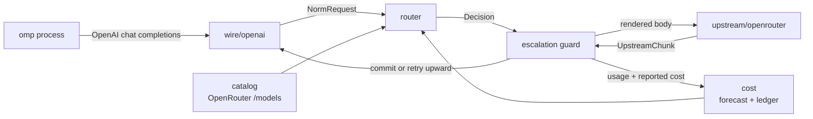

# omp-router

A local model router for [Oh My Pi](https://github.com/oh-my-pi). It presents
itself as one keyless OpenAI-compatible provider, then picks a concrete
OpenRouter model **per turn** based on measured price and estimated task
complexity — including mid-conversation, when a session shifts from mechanical
tool-loop churn to genuine reasoning work.

All LLM inference is offloaded to OpenRouter. Nothing runs on-device except
routing arithmetic.

omp-router runs **embedded inside the omp process** (as an omp extension) — no
separate server, no orphaned process. It binds a free OS-assigned port and
lives and dies with the omp session.

## Why this exists when OpenRouter already ships routers

OpenRouter has `openrouter/auto` (market-spend classifier) and
`openrouter/pareto-code` (Artificial Analysis coding percentile → cheapest in
tier). Both are opaque, server-side, and — per Pareto's own docs — *"you can't
directly cap cost or latency per request."*

This router exists for the things a prompt classifier structurally cannot do:

| Lever | Why it needs to be local |
| --- | --- |
| **Agent-loop awareness** | OpenRouter sees a prompt. We see omp's tool array, tool-result depth, and whether the previous tool call failed. Most agent turns are mechanical post-tool-result continuations — the largest cost lever in agent traffic, and invisible upstream. |
| **Budget enforcement** | Per-turn, per-conversation, and rolling-24h caps, checked against a **cold-cache forecast** before dispatch, with forced downgrade at the ceiling. |
| **Mid-stream escalation** | Hold the first N tokens; on a malformed tool call, refusal, empty completion, or repeated tool call, abort and re-dispatch upward. omp never observes the failure. |
| **Cache-aware hysteresis** | Switching models forfeits the warm prompt cache. The decision is arithmetic, not vibes: expected saving must beat the forfeited cache-read discount by a configured margin. |
| **Closed-loop trust** | Per-model escalation and error rates from *your* traffic demote cheap-but-flaky models automatically. |
| **Explainability** | Every decision — candidates, rejections, forecasts, reasons — is persisted and replayable via `omp-router explain`. |

## Architecture



The router runs in-process inside omp via the `router-embed` extension. The
core never parses a wire format. A front end produces a `NormRequest` and
consumes `UpstreamChunk`s, so a `pi-native` front end can be added later
without touching routing.

### Module map

| Path | Responsibility |
| --- | --- |
| `src/catalog/` | Fetch and normalize OpenRouter `/api/v1/models`: pricing, capability flags, Artificial Analysis quality indices. SQLite-cached with TTL. |
| `src/cost/` | Cost forecasting per candidate; reconciliation against OpenRouter's authoritative `usage.cost`; the spend ledger; per-model trust; rolling blended rate. |
| `src/tokens/` | Token estimation with no tokenizer dependency, self-calibrating from observed `prompt_tokens` per tokenizer family. |
| `src/wire/` | Protocol boundary. `wire/openai/` implements chat completions in and SSE out. |
| `src/router/` | Feature extraction, complexity classification, candidate filtering and scoring, hysteresis, cache-breakpoint placement, budget guard, probe planning. |
| `src/upstream/` | OpenRouter transport: streaming dispatch, `session_id` stickiness, error classification, fallback arrays. |
| `src/config/` | Configuration loading, schema validation, and the built-in defaults. |
| `src/cli/` | `stats`, `models`, `explain`, `config` commands. |
| `omp-extension/` | The omp extensions: `router-embed.ts`, `router-toast.ts`, `router-configure.ts`. |

### Two cost numbers, never conflated

- **Predicted** — our arithmetic over the catalog, computed *before* dispatch.
  Drives routing and budget guards. Must model `pricing.overrides` tiers, or
  long conversations are underestimated by ~50% exactly when it matters.
- **Reported** — `usage.cost` from OpenRouter, authoritative after the fact.
  Drives the ledger, `stats`, and prediction-error calibration.

## Requirements

- **omp** (the Oh My Pi harness) — the router runs as an omp extension.
- **Bun** `>= 1.2.0` — omp itself is a Bun process; the router code runs inside
  it. No separate Bun install is needed for the embedded path.

## Installation

There is nothing to install system-wide. Run the cross-platform installer
(Windows, macOS, Linux) from the repo:

```bash
bun tools/install.ts
```

It wires the omp-router extensions into omp's `~/.omp/agent/config.yml`
(`$PI_CODING_AGENT_DIR/config.yml` when that env var relocates the agent dir),
backing up the previous file first. It is idempotent — re-running is a no-op.

Options:

```bash
bun tools/install.ts --no-toast --no-configure   # only the required embed extension
```

The installer adds:

- `router-embed.ts` — **required**; runs the router in-process.
- `router-toast.ts` — optional; chosen-model toasts.
- `router-configure.ts` — optional; the `/router` command.

Or add the paths by hand to omp's `~/.omp/agent/config.yml`:

```yaml
# ~/.omp/agent/config.yml
extensions:
  - /path/to/omp-router/omp-extension/router-embed.ts
  - /path/to/omp-router/omp-extension/router-toast.ts      # optional: chosen-model toasts
  - /path/to/omp-router/omp-extension/router-configure.ts # optional: /router command
```

Then restart the omp session (extensions load at session start).

There is nothing to install system-wide. Add the extension paths to omp's
`~/.omp/agent/config.yml`:

```yaml
# ~/.omp/agent/config.yml
extensions:
  - /path/to/omp-router/omp-extension/router-embed.ts
  - /path/to/omp-router/omp-extension/router-toast.ts      # optional: chosen-model toasts
  - /path/to/omp-router/omp-extension/router-configure.ts # optional: /router command
```

Then restart the omp session (extensions load at session start).

### The OpenRouter key

There should be exactly one OpenRouter key on the machine, and omp already owns
a credential store. Resolution order:

1. `openrouter.apiKey` in `$OMP_ROUTER_HOME/config.yml`
2. `OPENROUTER_API_KEY` (including any `.env` omp loaded into the environment)
3. **omp's own auth store** — `~/.omp/agent/agent.db`, provider `openrouter`

So `/login openrouter` inside omp is sufficient setup; nothing needs copying.
The store is opened read-only and never written: omp owns it, including OAuth
refresh. An expired OAuth access token is rejected rather than sent, because
refreshing is omp's job and a stale bearer just burns a turn on a 401. Under
`OMP_AUTH_BROKER_URL` the local store is not consulted at all, since a broker
replaces it.

The embedded router reports the key source via its in-process `GET /health`
(`config` | `env` | `omp-auth-store` | `none`) — never the key itself.

---

At session start, the **main** omp session's `router-embed.ts`:

1. binds a **free OS-assigned port** (`Bun.serve({ port: 0 })`) so several omp
   sessions never collide on a fixed port;
2. writes the actual bound port to the shared `$OMP_ROUTER_HOME/embed.port`;
3. registers an `omp-router` provider with omp (`auto`, `auto-cheap`, `auto-max`
   virtual models) pointing at `http://127.0.0.1:$PORT/v1`.

Subagents do **not** bind their own router. They are ephemeral worker processes
whose PIDs get recycled, so a per-process port file is a race. Instead every
subagent registers the same shared provider and routes to the main session's
single router, whose port lives in the one shared `embed.port` file — one
authoritative writer, no stale per-PID port.

The router lives and dies with the main omp session — no orphan process, no "is
the server running?" stopping the omp process frees the port automatically.

### Multiple omp sessions, one machine

Each top-level omp session binds its own router on its own ephemeral port, so
they never conflict. The `X-Omp-Harness` header (from `server.harnessId`)
scopes budgets, toasts, and optional trust per harness.

---

## Selecting the provider / model

The router registers three virtual models under the `omp-router` provider:

| Profile | Min tier | Max tier | Use |
| --- | --- | --- | --- |
| `auto` | trivial | hard | Default — routes by complexity across the whole range. |
| `auto-cheap` | trivial | simple | Cost-first — caps at the `simple` tier. |
| `auto-max` | moderate | hard | Quality-first — never below `moderate`. |

Select one in omp via `/model` and pick `omp-router/auto` (or one of the
others). Or set it as the default for a role in `~/.omp/agent/config.yml`:

```yaml
modelRoles:
  default: omp-router/auto
```

The router decides the concrete OpenRouter model **per turn**; omp only sees the
virtual profile it picked. Every routed response carries
`x-omp-router-model`, `x-omp-router-tier`, `x-omp-router-cost-usd`, and
`x-omp-router-attempts`.

---

## Configuring the router

There are two ways to edit the router's own config (`$OMP_ROUTER_HOME/config.yml`,
default `~/.omp-router/config.yml`):

### Via `/router` (in-omp, native UI)

Install the `router-configure` extension, restart omp, then run `/router` in the session prompt.

It shows a section picker (Server, OpenRouter, Tiers, Tasks, Filters,
Classifier, Escalation, Hysteresis, Cache, Budget, Ledger, Logging, Profiles).
Each field prompts through omp's native UI dialogs — empty input keeps the
current value, `-` clears an optional field. `Save and exit` writes the merged
config (schema-checked and backed up first). Restart the omp session after
saving.

### Via `omp-router config` (text wizard / CLI)

```bash
omp-router config
```

Same fields, prompted on the terminal. Also:

- `omp-router config --print` — prints the `models.yml` provider block.
- `omp-router config --write` — merges that block into omp's `models.yml`.

Both write paths validate the merged file against the schema before touching
disk and back up the previous file to a timestamped `.bak`.

### Configuration file location

- Router config: `$OMP_ROUTER_HOME/config.yml` (default `~/.omp-router/config.yml`).
- Ledger DB: `$OMP_ROUTER_HOME/router.db` (SQLite, WAL).

### Environment variables

| Variable | Purpose | Default |
| --- | --- | --- |
| `OPENROUTER_API_KEY` | OpenRouter key (overrides the auth store). | — |
| `OMP_ROUTER_HOME` | Config + database directory. | `~/.omp-router` |
| `OMP_ROUTER_PORT` | Pin a specific bind port (rarely needed; the embedded router picks a free one otherwise). | OS-assigned |
| `OMP_ROUTER_LOG` | Log level: `silent`/`error`/`warn`/`info`/`debug`. | `info` |
| `OMP_ROUTER_DB` | Override the ledger path. | `$OMP_ROUTER_HOME/router.db` |
| `OMP_ROUTER_URL` | Toast/base URL override (the toast reads the PID-scoped port file first). | — |
| `OMP_ROUTER_API_KEY` | Client bearer for the toast poll when `server.apiKey` is set. | — |
| `OMP_HARNESS_ID` | Per-harness toast scoping. | — |

---

## Default configuration

The built-in defaults (everything below can be overridden in `config.yml`):

| Key | Default | Meaning |
| --- | --- | --- |
| `server.host` / `server.port` | `127.0.0.1` / `0` | Bind host; `0` = free OS-assigned port. |
| `server.apiKey` / `server.harnessId` | unset | Client bearer; harness id for per-harness budgets/toasts. |
| `openrouter.baseUrl` | `https://openrouter.ai/api/v1` | Upstream. |
| `openrouter.timeoutMs` | `600000` | Request timeout. |
| `openrouter.catalogTtlMs` | `21600000` (6 h) | Catalog cache TTL. |
| `openrouter.catalogRefreshMs` | `300000` (5 min) | Background catalog refetch. |
| `adaptiveTierFloors` | `true` | Derive tier floors from available models. |
| `tiers.trivial/simple/moderate/hard.minQuality` | `0/40/60/72` | Quality floors (coding axis). |
| `tiers.trivial/simple/moderate.maxInputPerMtok` | `0.3/1.5/4.0` | Price ceilings; `hard` has none. |
| `tiers.*.qualityExponent` | `0/0/1/3` | Price-quality tradeoff per tier. |
| `tasks.*` | coding/vision/doc/data/chat axes | Task → axis + capability. |
| `filters.includeFree` | `false` | Free models are rate-limited hard; excluded. |
| `filters.requireToolSupport` | `true` | Only tool-capable models. |
| `filters.minTrust` / `minTrustSamples` | `0.7` / `12` | Trust bar; demote flaky models. |
| `filters.trustScopedByHarness` | `false` | Shared trust across harnesses. |
| `classifier.ambiguityThreshold` | `0.6` | When to use the adjudicator model. |
| `escalation.enabled` | `true` | Mid-stream escalation guard. |
| `escalation.maxAttempts` | `3` | Original try + two retries. |
| `escalation.triggers` | 5 signals | Malformed args, refusal, empty, repeat, missing tool. |
| `hysteresis.holdTurns` | `2` | Hold a model this many turns after choosing it. |
| `hysteresis.switchMargin` | `1.3` | Switching must beat the warm-cache discount. |
| `cache.injectBreakpoints` / `maxBreakpoints` | `true` / `4` | Prompt-cache breakpoint placement. |
| `budget.perTurnUsd` / `perConversationUsd` / `perDayUsd` | unset | No caps by default. |
| `budget.onExceeded` | `downgrade` | Downgrade rather than fail at a ceiling. |
| `profiles` | `auto`, `auto-cheap`, `auto-max` | The three virtual profiles above. |
| `ledger.blendWindowDays` / `blendMinSamples` | `7` / `25` | Measured cost blend. |
| `ledger.fallbackBlend` | input `1.5`, output `7.5` | Pre-measurement blend for omp's display. |
| `logLevel` | `info` | |

The full set of configurable fields (the ones `/router` walks) is the
same set `omp config` walks — Server, OpenRouter, Tiers, Tasks, Filters,
Classifier, Escalation, Hysteresis, Cache, Budgets, Ledger, Logging, plus the
Profiles list.

---

## Multiple coding harnesses, one router

A single embedded router can serve several omp sessions without them stepping
on each other:

- **Per-conversation routing** (hysteresis, cache warmth, escalation, spend) is
  keyed by conversation, so different sessions isolate naturally.
- **Per-harness daily budget** — each harness sends an `X-Omp-Harness` header
  (from the provider block's `headers:`), and the router scopes the rolling
  24h `perDayUsd` ceiling to it. One harness can't exhaust the day for another.
- **Per-harness toasts** — set `OMP_HARNESS_ID` to the same value so the
  extension only toasts that harness's model choices.

Configure a harness by setting `server.harnessId`; set the same id in that
harness's `OMP_HARNESS_ID` env var.

**Model trust is shared by default** (`filters.trustScopedByHarness: false`):
every harness's attempts count toward each model's reliability score, so the
demotion guard converges on more samples and stays effective even with a small
guardrail-narrowed catalog. Enable `trustScopedByHarness: true` to read each
harness's reliability from only its own ledger rows.

---

## Toast notifications for the chosen model

omp-router is headless and cannot draw into omp's TUI, so chosen-model toasts
come from a small omp extension that polls the router's in-process ledger:

```ts
// omp-extension/router-toast.ts  (shipped in this repo)
```

It raises a TUI toast (`ctx.ui.notify`) like
`meta/muse-glimmer-30b [trivial] · $0.00001` whenever a new model is chosen.
Install it by adding the file's absolute path to omp's `extensions:` list.

Because the embedded router binds a random port, the toast resolves the router
base URL on every poll in this order: the embedded router's port file
(`$OMP_ROUTER_HOME/embed.<pid>`), then `OMP_ROUTER_URL`, then `OMP_ROUTER_PORT`,
then the router's own `config.yml`, then `http://127.0.0.1:8788`. Reading the
port file each tick means the toast always polls the port the router actually
bound, even though it changes every session.

The toast logic is a pure, unit-tested module
(`omp-extension/toast-logic.ts`, covered by `test/toast-logic.test.ts`): it
toasts only decisions newer than the last seen one, skips `wasted` escalation
attempts, and prefers the actual serving slug over the requested one.

---

## Verifying

```bash
bun run typecheck   # strict, exactOptionalPropertyTypes + noUncheckedIndexedAccess
bun test            # unit suite
bun run smoke       # end-to-end against a scriptable mock OpenRouter
```

`bun smoke` starts the embedded router against `tools/mock-openrouter.ts`, which
serves a genuine catalog fixture and synthesizes OpenRouter-shaped SSE. It
asserts the properties that matter: no `openrouter/*`, `~alias`, `:batch`, or
`stealth/*` slug is ever selected; a mechanical tool-result continuation routes
to a cheaper tier than an architecture question in the same conversation; a
malformed tool call is escalated to a stronger model without the client ever
seeing the failure; and the abandoned attempt is booked as wasted spend.

`omp-router explain --file request.json` routes a saved request and prints the
feature vector, classification reasoning, ranked candidates with forecasts, and
every rejection with its cause — without dispatching a completion.

---

## Where quality scores come from

Tier floors are points on the Artificial Analysis index, which OpenRouter
publishes per model under `benchmarks.artificial_analysis` (coding, agentic and
intelligence). Two things about that data drive the router's behaviour:

**`/models/user` omits it entirely.** The key-scoped endpoint is authoritative
for *availability* under your guardrails, but its records carry no `benchmarks`
block. Read on its own it makes every model **unscored**, and an unscored model
satisfies no floor above zero — so `simple`, `moderate` and `hard` all go
permanently empty, selection widens down, and every turn is served by the
cheapest `trivial` model no matter how hard the work is. The router therefore
fetches the public `/models` purely to join the scores back on by id.
Availability still comes solely from the key-scoped list. The join is
best-effort: if the public fetch fails, the catalog stays unscored and degraded
rather than the refresh failing.

**Roughly 60% of the catalog is unscored anyway.** Scores are never imputed
from price, so unscored models are only ever eligible where the floor is zero.

---

## Adaptive tier floors

The configured floors (`trivial` 0, `simple` 40, `moderate` 60, `hard` 72) are
absolute points tuned against the full ~420-model catalog. A guardrail can
narrow your available set to models that all sit below them, at which point an
absolute floor admits nothing and the router is trapped in the lowest tier.

With `adaptiveTierFloors: true` (the default), every catalog refresh ranks the
**available** scored models and splits them into four quantile bands, taking
each band's lower bound as that tier's adaptive floor. The floor actually
enforced is `min(configured, adaptive)`:

- a healthy catalog keeps the configured floors verbatim — no behaviour change;
- a narrowed catalog falls back to the adaptive floor, so `hard` still gets the
  best quartile of what is available instead of nothing.

Relaxation is one-directional by design: an adaptive floor may only **lower** a
tier floor, never raise one. Two things are deliberately exempt:

- **Task floors are never relaxed.** `tasks.*.minQuality` is a capability
  requirement (vision needs a model that can actually see), not an economic
  envelope, so the effective floor is `max(taskFloor, adaptiveTierFloor)`.
- **Unscored catalogs relax to zero.** With no measured spread to rank on, all
  four floors compute to 0 and the price ceiling plus `qualityExponent` do the
  differentiating.

`omp-router models` shows any relaxation explicitly:

```
[hard]  quality floor 95 → 76.1 (adaptive) on the coding axis  -  3 eligible, 16 excluded
```

---

## Raising quality for coding work

Tier floors are economic envelopes; `tasks.*.minQuality` is the knob for "I
want coding turns to use competent models regardless of tier". It RAISES the
floor at every tier and is never relaxed by adaptive floors, while the tier
price ceilings still cap what each tier may spend:

```yaml
tasks:
  coding:
    axis: coding
    minQuality: 68
```

`omp-router models` names whichever mechanism moved a floor, so a surprising
eligible set is always explainable.

This is usually the right dial for an agentic coding harness. Most turns after
the first are tool-result continuations, which the complexity heuristic scores
as mechanical — correct for a single file read, but it means a long, genuinely
hard session keeps classifying `trivial`. A task floor lifts the quality of
whatever tier is chosen without forcing every turn into an expensive tier.

---

## Tier rescue

The tier envelopes (price ceilings, quality floors, trust bar) are tuned against
the full catalog, but OpenRouter guardrails can shrink a key's *available* set
down to a handful of models — all of which may fail every strict tier. When that
happens the router does not fail the turn; it progressively relaxes the
economic constraints (price ceilings → quality floors → trust bar) until some
**available** model qualifies. The hard capability filters (tool/image/context
support) and the key-scoped allowlist are never lifted, so the rescue can never
select a model the key cannot serve. Every rescue is recorded in the decision
trail (`tier rescue: strict config excluded all available models; relaxed …`).

## Status

Working end to end against a live `OPENROUTER_API_KEY` and a guardrail-limited
account; contracts are frozen in `src/**/types.ts`.

Known gaps:

- The `pi-native` front end is designed for but not implemented; only the
  OpenAI-compatible wire exists today.
- Blended `cost` figures in `models.yml` are refreshed by re-running
  `omp-router config --write`, not automatically.
